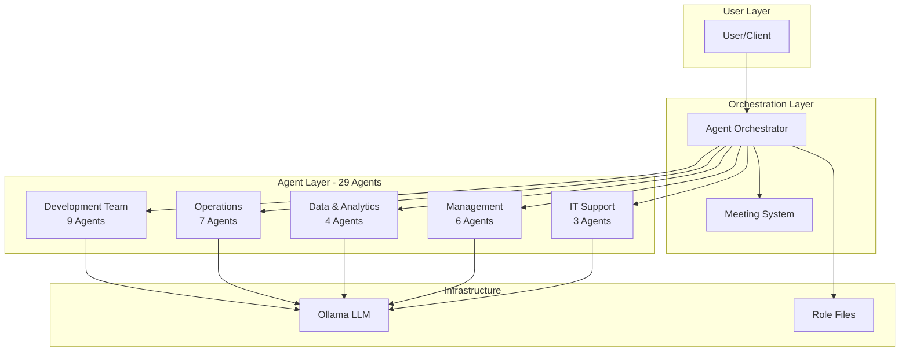

# Multi-Agent Orchestrator System

<div align="center">

**A comprehensive AI-powered multi-agent system featuring 29 specialized agents for software development, operations, and management**

[](https://www.python.org/downloads/)
[](https://ollama.ai)
[](LICENSE)

[Features](#-key-features) • [Quick Start](#-quick-start) • [Documentation](#-documentation) • [Examples](#-usage-examples)

</div>

---

## 📖 Overview

The Multi-Agent Orchestrator System is a powerful AI platform that brings together **29 specialized agents** to collaborate on complex software development tasks. Each agent has unique expertise and can work independently or as part of intelligent meetings and workflows.

### What Makes This Special?

- **🤖 29 Specialized Agents**: Complete coverage across development, operations, data, management, and support
- **🎯 Intelligent Meetings**: 20+ meeting types with automatic participant selection
- **🔄 Collaborative Workflows**: Agents build on each other's responses for complex tasks
- **🏠 100% Local**: Powered by Ollama - no cloud dependencies, complete privacy
- **📝 Role-Based**: Each agent uses specialized role definitions for authentic expertise
- **💾 Memory Management**: Conversation history tracking for contextual interactions

## 🎯 Key Features

### 29 Specialized Agents

| Category | Agents | Count |
|----------|--------|-------|
| **Development** | Backend, Frontend, Full Stack, Mobile (Android/iOS), QA, UI/UX, Technical Writer, Security | 9 |
| **Operations** | DevOps, SRE, Network, System Admin, Cloud Architect, Solutions Architect, DevOps Manager | 7 |
| **Data** | Data Engineer, Data Analyst, BI Analyst, Database Admin | 4 |
| **Management** | Product Manager, Project Manager, Scrum Master, Engineering Manager, IT Manager, CTO | 6 |
| **Support** | IT Support L1, L2, L3 | 3 |

### Intelligent Meeting System

- **20+ Meeting Types**: Daily Standup, Sprint Planning, Architecture Review, Security Review, Steerco, and more
- **Smart Participant Selection**: Automatically assigns relevant agents based on meeting type
- **Outcome Tracking**: Action items, decisions, and notes
- **Meeting History**: Complete audit trail of all meetings

### Collaborative Workflows

- **Sequential Execution**: Agents build on previous responses
- **Parallel Consultation**: Get multiple perspectives simultaneously
- **Context Sharing**: Agents receive full conversation history
- **Flexible Configuration**: Customize workflows for any scenario

## 🚀 Quick Start

### Prerequisites

```bash
# Install Ollama
curl -fsSL https://ollama.ai/install.sh | sh

# Pull the model
ollama pull llama3.2

# Clone repository
git clone https://github.com/yourusername/local_llm_agents.git
cd local_llm_agents

# Install dependencies
pip install -r requirements.txt
```

### Your First Agent Interaction

```python
from agents.orchestrator import AgentOrchestrator

# Initialize orchestrator
orchestrator = AgentOrchestrator()

# Chat with an agent
response = orchestrator.chat_with_agent(
    "backend_developer",
    "How should I design a REST API for user authentication?"
)

print(response)
```

### Your First Meeting

```python
from agents.utils.meeting import MeetingType

# Create a sprint planning meeting
meeting = orchestrator.create_meeting(
    meeting_type=MeetingType.SPRINT_PLANNING,
    title="Sprint 24 Planning",
    description="Plan next sprint deliverables"
)

# Conduct the meeting
topics = [
    "User Story: OAuth2 authentication",
    "User Story: Real-time notifications",
    "Technical debt: Database optimization"
]

result = orchestrator.conduct_meeting(meeting, topics)

# Get summary
summary = orchestrator.get_meeting_summary(meeting)
print(summary)
```

## 📊 System Architecture



## 💡 Usage Examples

### Example 1: Multi-Agent Consultation

```python
# Get opinions from multiple experts
responses = orchestrator.multi_agent_consultation(
    query="Should we use microservices or monolithic architecture?",
    agent_names=[
        "solutions_architect",
        "backend_developer",
        "devops_engineer",
        "cloud_architect"
    ]
)

for agent, response in responses.items():
    print(f"\n{agent}: {response}")
```

### Example 2: Collaborative Workflow

```python
# Define a workflow where each agent builds on previous responses
workflow = [
    {"agent": "product_manager", "action": "chat"},
    {"agent": "solutions_architect", "action": "chat"},
    {"agent": "backend_developer", "action": "chat"},
    {"agent": "security_engineer", "action": "chat"},
    {"agent": "devops_engineer", "action": "chat"}
]

results = orchestrator.collaborative_task(
    task_description="Design a secure payment processing system",
    workflow=workflow
)
```

### Example 3: Architecture Review Meeting

```python
# Create architecture review with automatic participant selection
meeting = orchestrator.create_meeting(
    meeting_type=MeetingType.ARCHITECTURE_REVIEW,
    title="Microservices Architecture Review",
    description="Review proposed architecture"
)

# Participants automatically include:
# - Solutions Architect, Cloud Architect, Backend Developer,
# - Frontend Developer, DevOps Engineer, Data Engineer, Security Engineer

topics = [
    "Service boundaries and domain modeling",
    "Inter-service communication patterns",
    "Data consistency and transactions",
    "Monitoring and observability"
]

result = orchestrator.conduct_meeting(meeting, topics)
```

### Example 4: Incident Response

```python
# Quick incident analysis
incident_responses = orchestrator.multi_agent_consultation(
    query="Production database CPU at 95%, queries timing out. What should we check?",
    agent_names=[
        "site_reliability_engineer",
        "database_administrator",
        "backend_developer",
        "devops_engineer"
    ]
)

# Conduct postmortem meeting
postmortem = orchestrator.create_meeting(
    meeting_type=MeetingType.INCIDENT_POSTMORTEM,
    title="Database Performance Incident",
    description="Analyze root cause and prevention"
)

topics = [
    "Timeline of events",
    "Root cause analysis",
    "Impact assessment",
    "Prevention measures"
]

result = orchestrator.conduct_meeting(postmortem, topics)
```

## 📁 Project Structure

```
local_llm_agents/
├── agents/                      # Agent implementations
│   ├── backend_developer/
│   ├── frontend_developer/
│   ├── ... (all 29 agents)
│   ├── utils/
│   │   ├── base_agent.py       # Base agent class
│   │   ├── role_loader.py      # Role file loader
│   │   └── meeting.py          # Meeting system
│   └── orchestrator.py         # Main orchestrator
├── Role/                        # Role definition files
│   ├── Software_Developer_Backend.txt
│   ├── ... (29 role files)
├── docs/                        # Documentation
│   ├── UML_DIAGRAMS.md         # UML diagrams (25+ diagrams)
│   ├── ARCHITECTURE.md         # System architecture
│   ├── API_REFERENCE.md        # Complete API docs
│   ├── DEPLOYMENT_GUIDE.md     # Deployment instructions
│   ├── MEETING_SYSTEM.md       # Meeting system guide
│   ├── USAGE_EXAMPLES.md       # Usage examples
│   ├── INDEX.md                # Documentation index
│   └── ALL_AGENTS_SUMMARY.md   # Agent reference
├── examples/                    # Example scripts
│   └── meeting_examples.py
├── tests/                       # Test suite
│   ├── test_all_agents.py
│   └── test_meeting_system.py
└── requirements.txt             # Python dependencies
```

## 📚 Documentation

### Core Documentation

- **[UML Diagrams](docs/UML_DIAGRAMS.md)** - ⭐ **NEW** Comprehensive UML diagrams (Class, Sequence, Component, State, Activity, Deployment)
- **[Architecture Documentation](docs/ARCHITECTURE.md)** - System design, diagrams, and technical architecture
- **[API Reference](docs/API_REFERENCE.md)** - Complete API documentation with examples
- **[Deployment Guide](docs/DEPLOYMENT_GUIDE.md)** - Installation, configuration, and deployment
- **[Meeting System](docs/MEETING_SYSTEM.md)** - Meeting types, participants, and workflows
- **[Usage Examples](docs/USAGE_EXAMPLES.md)** - Real-world scenarios and tutorials

### Reference Documentation

- **[Documentation Index](docs/INDEX.md)** - Complete documentation navigation and guide
- **[All Agents Summary](docs/ALL_AGENTS_SUMMARY.md)** - Complete list of all 29 agents
- **[Meeting Quick Reference](docs/MEETING_QUICK_REFERENCE.md)** - Quick meeting system guide
- **[Agent Development Completion](docs/AGENT_DEVELOPMENT_COMPLETION.md)** - Development summary

## 🎨 Use Cases

### Software Development
- Sprint planning and backlog refinement
- Code reviews and technical design
- Architecture decisions
- Feature development workflows

### Operations & DevOps
- Incident response and postmortems
- Deployment planning
- Capacity planning
- Infrastructure design

### Security & Compliance
- Security audits and reviews
- Compliance assessments
- Vulnerability analysis
- Security architecture design

### Management & Strategy
- Executive steering committees
- Product roadmap planning
- Resource allocation
- Technology strategy

## 🧪 Testing

```bash
# Test all agents
python tests/test_all_agents.py

# Test meeting system
python tests/test_meeting_system.py

# Run examples
python examples/meeting_examples.py
```

## ⚙️ Configuration

### Custom Model

```python
orchestrator = AgentOrchestrator(
    model_name="mistral",      # Use different Ollama model
    temperature=0.7,           # Adjust creativity (0.0-1.0)
    role_folder="Role"         # Custom role files location
)
```

### Environment Variables

```bash
# .env file
OLLAMA_HOST=http://localhost:11434
DEFAULT_MODEL=llama3.2
DEFAULT_TEMPERATURE=0.7
ROLE_FOLDER=Role
```

## 🔧 Advanced Features

### Memory Management

```python
# Clear specific agent memory
orchestrator.clear_agent_memory("backend_developer")

# Clear all memories
orchestrator.clear_all_memories()
```

### Custom Meeting Participants

```python
# Override default participants
meeting = orchestrator.create_meeting(
    meeting_type=MeetingType.ARCHITECTURE_REVIEW,
    title="Custom Review",
    custom_participants=["cto", "solutions_architect", "security_engineer"]
)
```

### Agent Information

```python
# Get agent details
info = orchestrator.get_agent_info("security_engineer")
print(f"Role: {info['role']}")
print(f"Description: {info['description']}")

# List all agents
agents = orchestrator.list_agents()
print(f"Total agents: {len(agents)}")
```

## 🚀 Deployment Options

### Local Development
```bash
ollama serve
python main.py
```

### Docker
```bash
docker-compose up -d
```

### Kubernetes
```bash
kubectl apply -f k8s/
```

See [Deployment Guide](docs/DEPLOYMENT_GUIDE.md) for detailed instructions.

## 🤝 Integration Examples

### Jira Integration
```python
# Create meeting from Jira sprint
sprint_issues = jira.search_issues('sprint = 24')
topics = [f"{issue.key}: {issue.fields.summary}" for issue in sprint_issues]
result = orchestrator.conduct_meeting(meeting, topics)
```

### Slack Integration
```python
# Post meeting summary to Slack
summary = orchestrator.get_meeting_summary(meeting)
slack_client.chat_postMessage(channel='#engineering', text=summary)
```

### GitHub Integration
```python
# Review pull requests
pull_requests = repo.get_pulls(state='open')
topics = [f"PR #{pr.number}: {pr.title}" for pr in pull_requests]
result = orchestrator.conduct_meeting(meeting, topics)
```

## 📈 Performance

- **Parallel Execution**: Multi-agent consultations run in parallel
- **Memory Efficient**: Conversation history managed per agent
- **Scalable**: Horizontal scaling with load balancing
- **Fast**: Local LLM inference with optional GPU acceleration

## 🔒 Security

- **100% Local**: No data sent to external services
- **Privacy First**: All processing happens on your infrastructure
- **Audit Trail**: Complete logging of all interactions
- **Access Control**: Implement your own authentication layer

## 🛠️ Troubleshooting

### Common Issues

**Ollama Connection Failed**
```bash
# Check if Ollama is running
ps aux | grep ollama

# Start Ollama
ollama serve
```

**Model Not Found**
```bash
# List available models
ollama list

# Pull missing model
ollama pull llama3.2
```

**Slow Response Times**
```bash
# Use GPU acceleration (if available)
# Or use smaller/quantized models
ollama pull llama3.2:q4_0
```

See [Deployment Guide](docs/DEPLOYMENT_GUIDE.md) for more troubleshooting.

## 🗺️ Roadmap

- [ ] Web UI for agent interactions
- [ ] Real-time collaboration features
- [ ] Agent learning and feedback loops
- [ ] Custom agent creation wizard
- [ ] Integration marketplace
- [ ] Analytics dashboard
- [ ] Multi-tenancy support

## 🤝 Contributing

Contributions are welcome! Areas for improvement:

1. Add more specialized agents
2. Create new meeting types
3. Implement agent tools and integrations
4. Add more workflow templates
5. Improve role definitions
6. Write additional tests
7. Enhance documentation

## 📝 License

This project is licensed under the MIT License - see the [LICENSE](LICENSE) file for details.

## 🙏 Acknowledgments

- **[Ollama](https://ollama.ai)** - Local LLM runtime
- **[LangChain](https://langchain.com)** - LLM framework
- **[Llama](https://ai.meta.com/llama/)** - Base language model

## 📞 Support

- **Documentation**: [docs/](docs/)
- **Issues**: [GitHub Issues](https://github.com/yourusername/local_llm_agents/issues)
- **Discussions**: [GitHub Discussions](https://github.com/yourusername/local_llm_agents/discussions)

## ⭐ Star History

If you find this project useful, please consider giving it a star! ⭐

---

<div align="center">

**Built with ❤️ for collaborative AI development**

[Get Started](#-quick-start) • [Documentation](#-documentation) • [Examples](#-usage-examples)

</div>
