# System Architecture Documentation

## Overview

The Multi-Agent Orchestrator System is a comprehensive AI-powered platform featuring 29 specialized agents that collaborate to handle complex software development, operations, and management tasks.

## High-Level Architecture

```mermaid
graph TB
    subgraph "User Interface Layer"
        USER[User/Client]
    end
    
    subgraph "Orchestration Layer"
        ORCH[Agent Orchestrator]
        MEET[Meeting System]
        ROLE[Role Loader]
    end
    
    subgraph "Agent Layer - Development Team"
        BE[Backend Developer]
        FE[Frontend Developer]
        FS[Full Stack Developer]
        MA[Mobile Android]
        MI[Mobile iOS]
        QA[QA Engineer]
        UI[UI/UX Designer]
        TW[Technical Writer]
        SE[Security Engineer]
    end
    
    subgraph "Agent Layer - Operations"
        DO[DevOps Engineer]
        SRE[Site Reliability Engineer]
        NE[Network Engineer]
        SA[System Administrator]
        CA[Cloud Architect]
        SOL[Solutions Architect]
        DOM[DevOps Manager]
    end
    
    subgraph "Agent Layer - Data"
        DE[Data Engineer]
        DA[Data Analyst]
        BI[BI Analyst]
        DBA[Database Admin]
    end
    
    subgraph "Agent Layer - Management"
        PM[Product Manager]
        PJM[Project Manager]
        SM[Scrum Master]
        EM[Engineering Manager]
        IM[IT Manager]
        CTO[CTO/CIO]
    end
    
    subgraph "Agent Layer - Support"
        L1[IT Support L1]
        L2[IT Support L2]
        L3[IT Support L3]
    end
    
    subgraph "Infrastructure Layer"
        LLM[Ollama LLM]
        ROLES[Role Files]
        MEM[Memory Store]
    end
    
    USER --> ORCH
    ORCH --> MEET
    ORCH --> ROLE
    
    ORCH --> BE & FE & FS & MA & MI & QA & UI & TW & SE
    ORCH --> DO & SRE & NE & SA & CA & SOL & DOM
    ORCH --> DE & DA & BI & DBA
    ORCH --> PM & PJM & SM & EM & IM & CTO
    ORCH --> L1 & L2 & L3
    
    BE & FE & FS & MA & MI & QA & UI & TW & SE --> LLM
    DO & SRE & NE & SA & CA & SOL & DOM --> LLM
    DE & DA & BI & DBA --> LLM
    PM & PJM & SM & EM & IM & CTO --> LLM
    L1 & L2 & L3 --> LLM
    
    ROLE --> ROLES
    BE & FE & FS & MA & MI & QA & UI & TW & SE --> MEM
    DO & SRE & NE & SA & CA & SOL & DOM --> MEM
    DE & DA & BI & DBA --> MEM
    PM & PJM & SM & EM & IM & CTO --> MEM
    L1 & L2 & L3 --> MEM
```

## Component Architecture

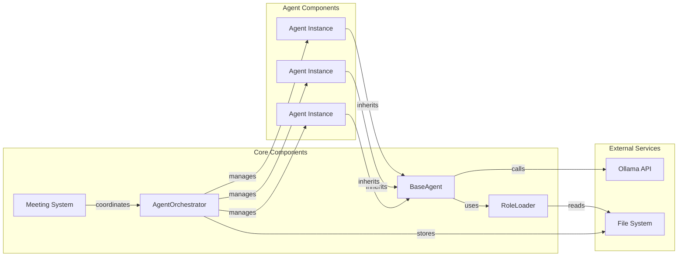

## Agent Categories

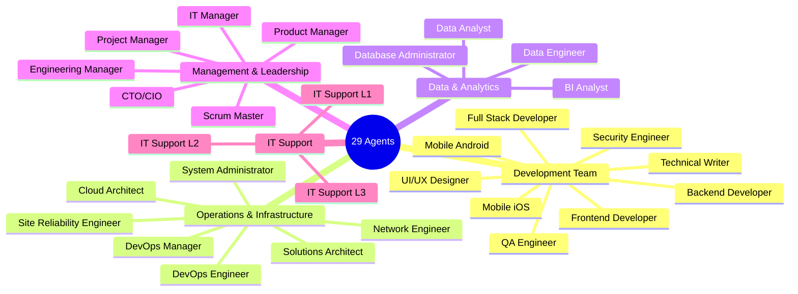

## Meeting System Architecture

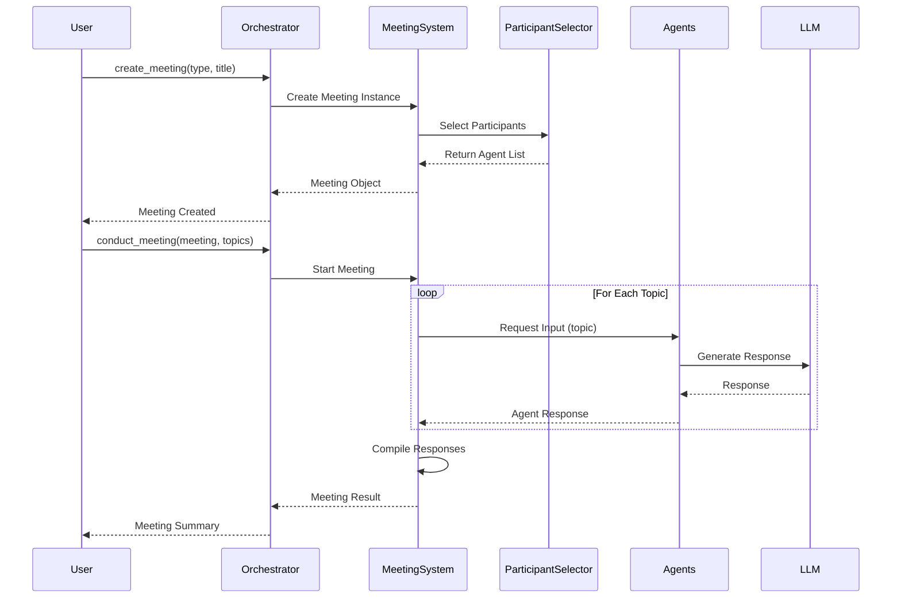

## Data Flow

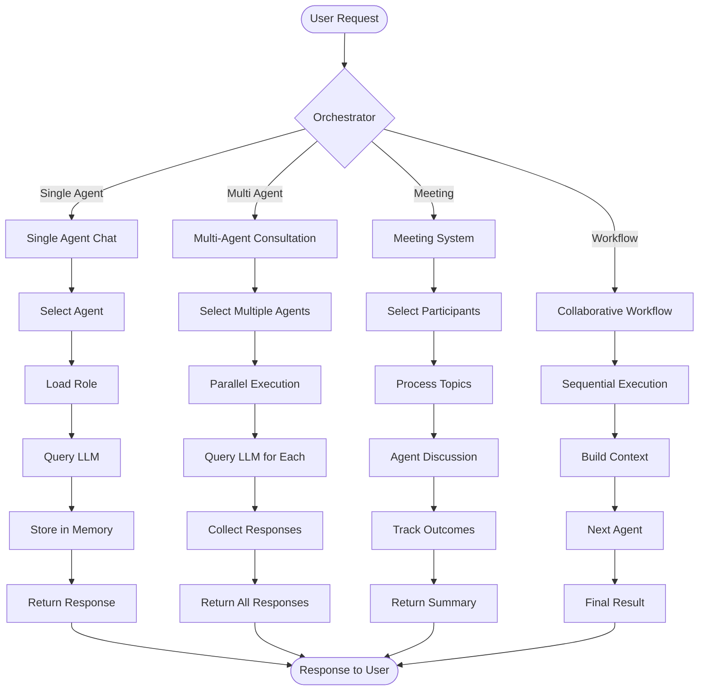

## Agent Interaction Patterns

### 1. Single Agent Interaction

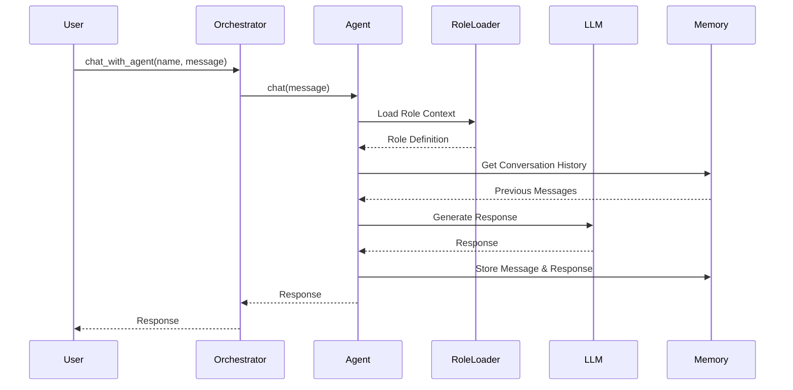

### 2. Multi-Agent Consultation

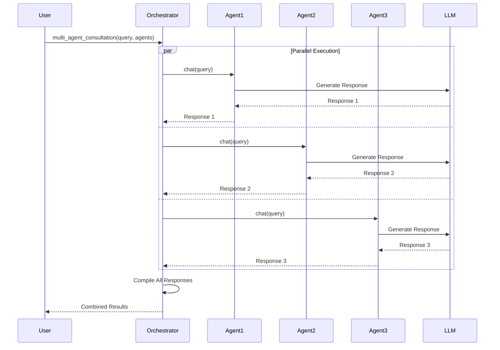

### 3. Collaborative Workflow

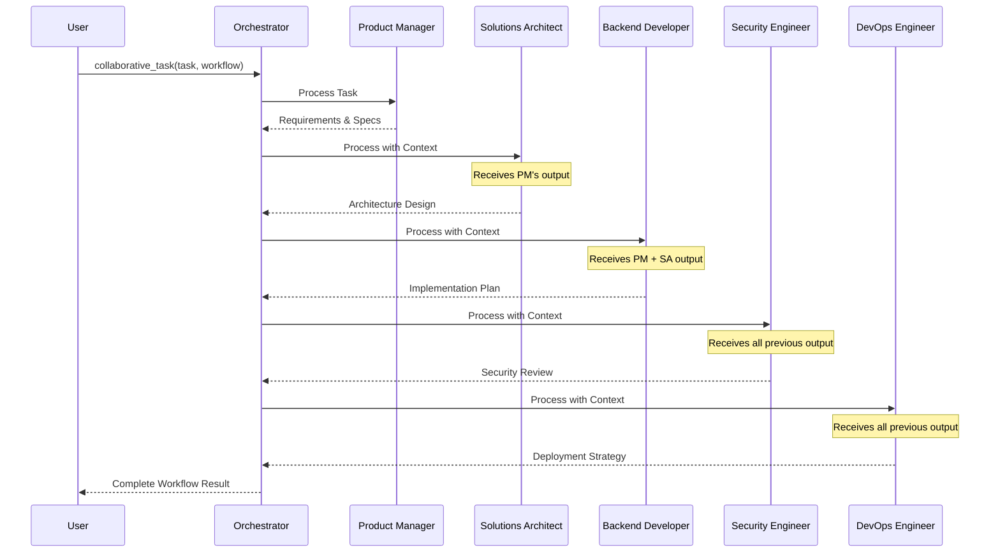

## Meeting Participant Selection

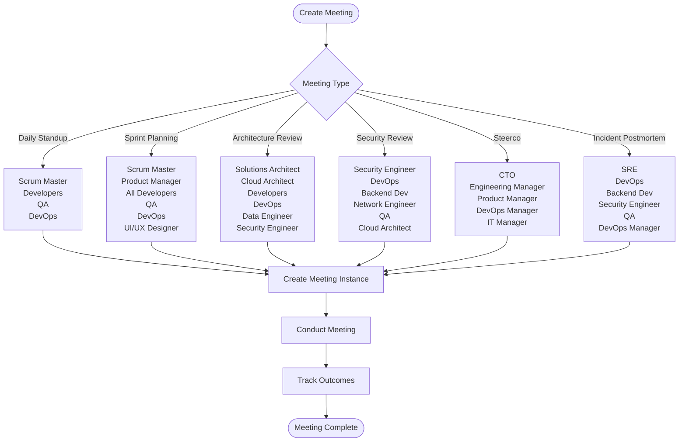

## Technology Stack

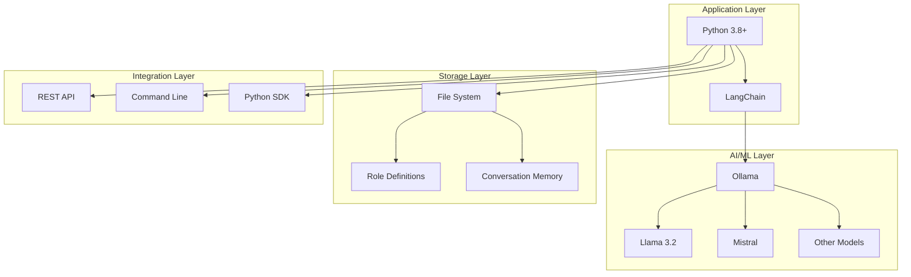

## Deployment Architecture

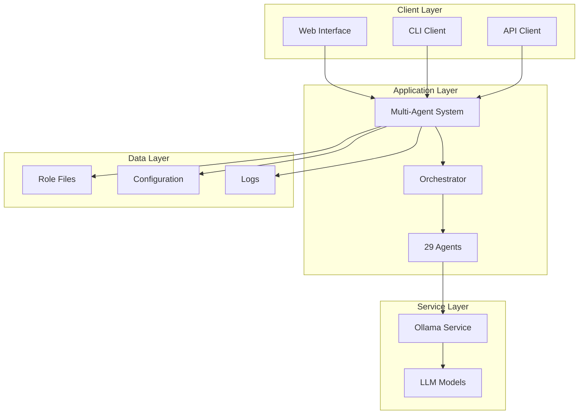

## Security Architecture

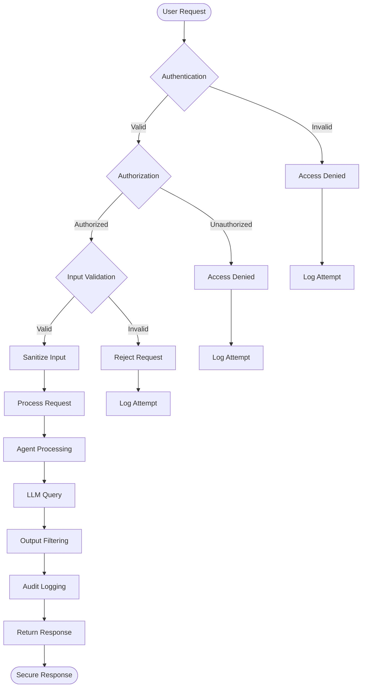

## Scalability Considerations

### Horizontal Scaling

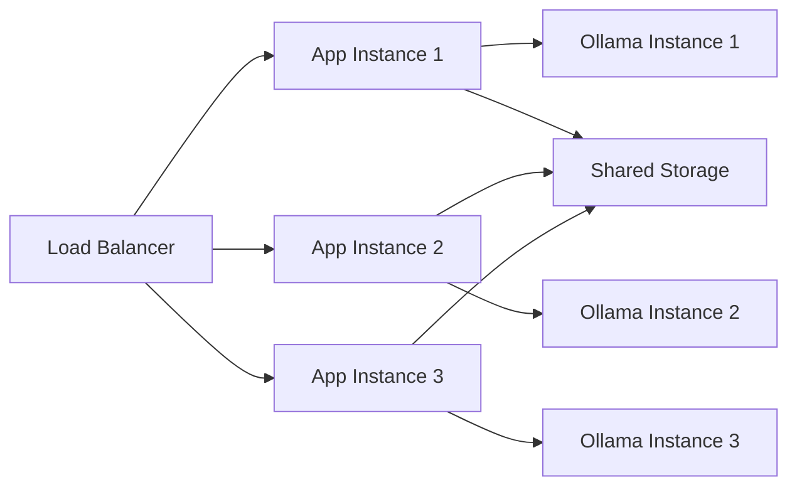

### Vertical Scaling

- **CPU**: Multi-core processing for parallel agent execution
- **Memory**: Sufficient RAM for LLM model loading and agent memory
- **Storage**: Fast SSD for role files and conversation history
- **GPU**: Optional GPU acceleration for LLM inference

## Performance Optimization

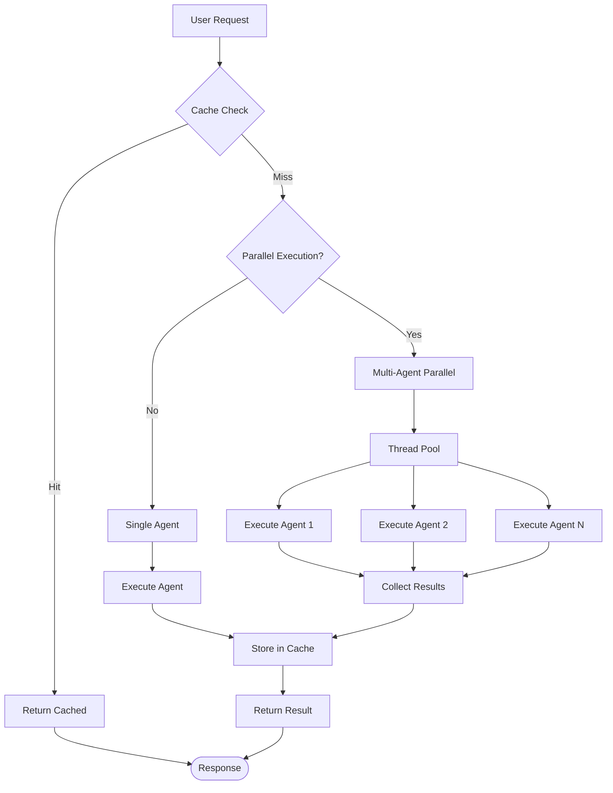

## Monitoring & Observability

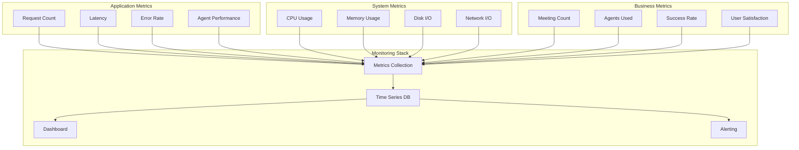

## Key Design Principles

### 1. Modularity
- Each agent is independent and self-contained
- Agents can be added or removed without affecting others
- Clear separation of concerns

### 2. Extensibility
- Easy to add new agents
- Simple to create new meeting types
- Flexible workflow definitions

### 3. Scalability
- Parallel agent execution
- Stateless agent design
- Horizontal scaling support

### 4. Maintainability
- Consistent code structure
- Comprehensive documentation
- Clear naming conventions

### 5. Reliability
- Error handling at all levels
- Graceful degradation
- Audit logging

## Integration Points

### External Systems

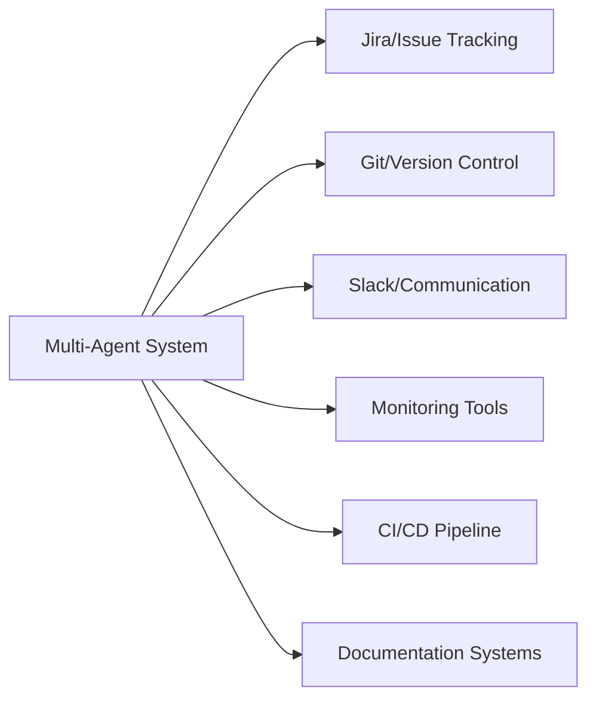

### API Endpoints

- `POST /agent/chat` - Single agent interaction
- `POST /agent/multi-consult` - Multi-agent consultation
- `POST /meeting/create` - Create meeting
- `POST /meeting/conduct` - Conduct meeting
- `GET /agents` - List all agents
- `GET /meetings` - List all meetings
- `GET /meeting/{id}` - Get meeting details

## Future Enhancements

1. **Real-time Collaboration**: WebSocket support for live meetings
2. **Agent Learning**: Feedback loop for agent improvement
3. **Custom Agents**: User-defined agent creation
4. **Integration Hub**: Pre-built integrations with popular tools
5. **Analytics Dashboard**: Visual insights into agent performance
6. **Multi-tenancy**: Support for multiple organizations
7. **Agent Marketplace**: Share and discover custom agents

## Conclusion

The Multi-Agent Orchestrator System provides a robust, scalable, and extensible platform for AI-powered collaboration. With 29 specialized agents and intelligent meeting facilitation, it enables complex workflows and decision-making processes across the entire software development lifecycle.
