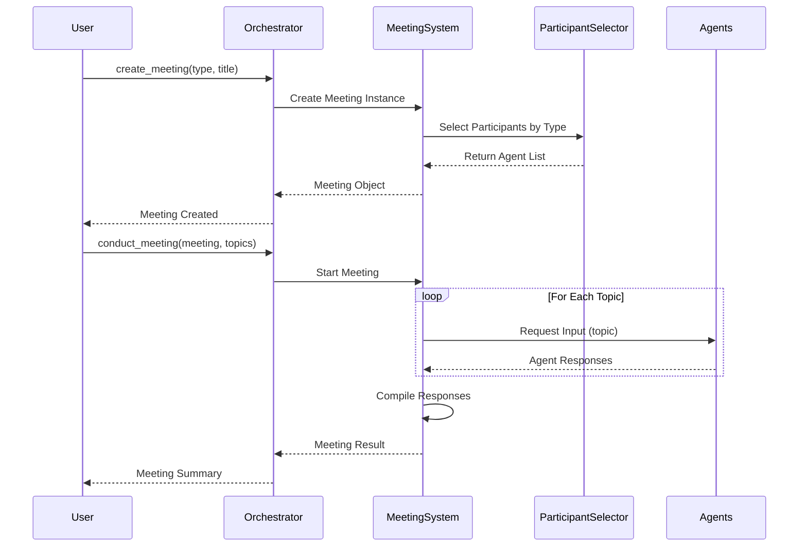
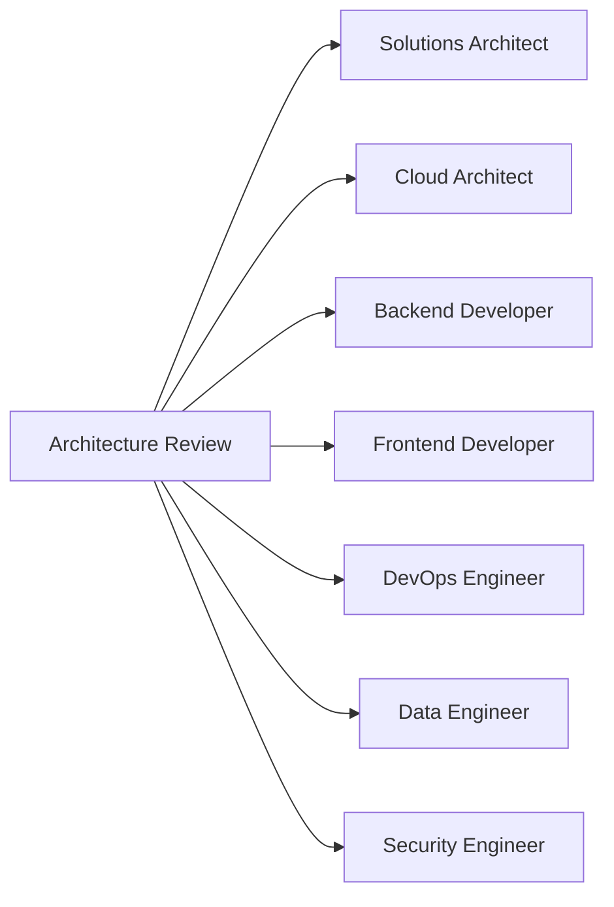
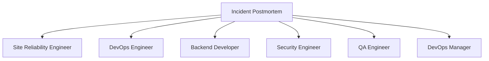
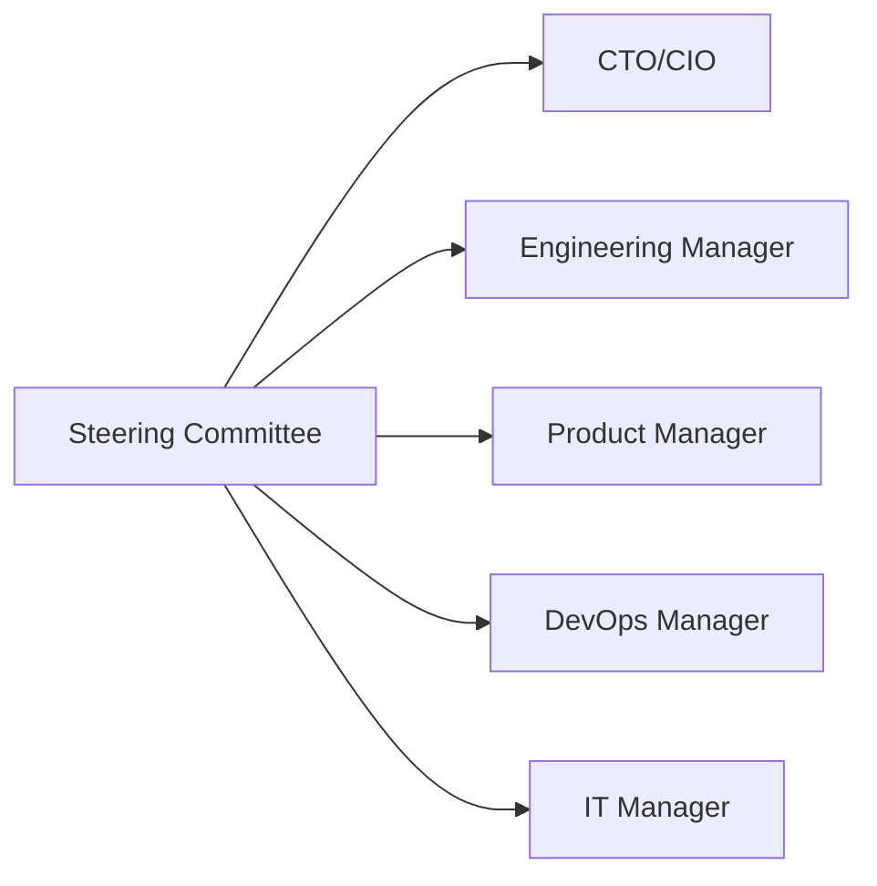
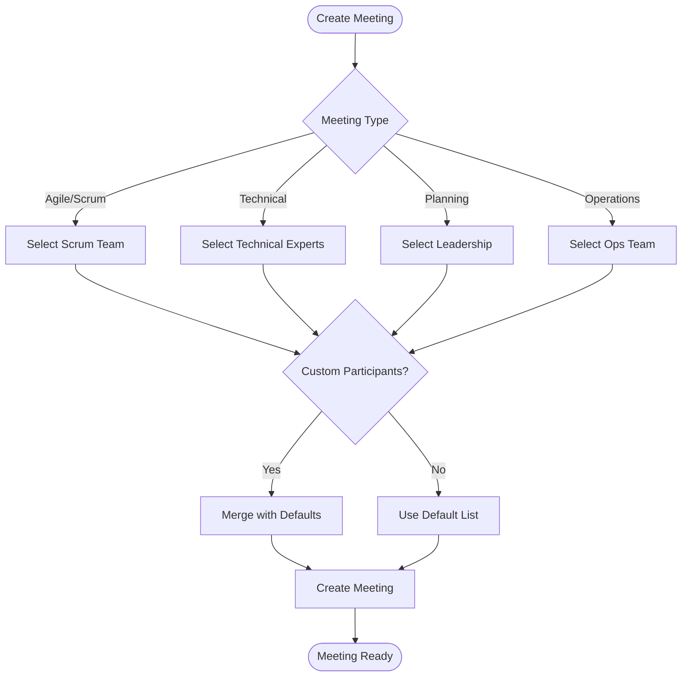

# Meeting System Documentation

## Overview

The Meeting System enables automated multi-agent meetings with role-based participation. Each meeting type automatically selects appropriate agent participants based on the meeting's purpose. With **29 specialized agents** and **20+ meeting types**, the system provides comprehensive coverage for all software development lifecycle activities.

## Features

- **20+ Meeting Types**: Pre-configured meeting types with automatic participant selection
- **29 Specialized Agents**: Complete coverage across development, operations, data, management, and support
- **Smart Participant Selection**: Automatically assigns relevant agents based on meeting type
- **Meeting Management**: Create, conduct, and track meetings with notes, action items, and decisions
- **Flexible Configuration**: Override participants, duration, and scheduling as needed
- **Meeting History**: Track all meetings and their outcomes
- **Collaborative Discussions**: Multi-agent discussions with context building

## Meeting Flow Diagram



## Meeting Types & Participants

### Agile/Scrum Meetings

#### Daily Standup (15 min)
**Participants:** Scrum Master, Backend Developer, Frontend Developer, Full Stack Developer, QA Engineer, DevOps Engineer

```python
meeting = orchestrator.create_meeting(
    meeting_type=MeetingType.DAILY_STANDUP,
    title="Daily Standup - Sprint 24"
)
```

#### Sprint Planning (120 min)
**Participants:** Scrum Master, Product Manager, Backend Developer, Frontend Developer, Full Stack Developer, Mobile Developer (Android), Mobile Developer (iOS), QA Engineer, DevOps Engineer, UI/UX Designer

```python
meeting = orchestrator.create_meeting(
    meeting_type=MeetingType.SPRINT_PLANNING,
    title="Sprint 24 Planning"
)
```

#### Sprint Review (60 min)
**Participants:** Scrum Master, Product Manager, Backend Developer, Frontend Developer, Full Stack Developer, QA Engineer, UI/UX Designer

#### Sprint Retrospective (90 min)
**Participants:** Scrum Master, Backend Developer, Frontend Developer, Full Stack Developer, QA Engineer, DevOps Engineer, Product Manager

#### Backlog Refinement (60 min)
**Participants:** Scrum Master, Product Manager, Backend Developer, Frontend Developer, QA Engineer

### Technical Meetings

#### Architecture Review (90 min)
**Participants:** Solutions Architect, Cloud Architect, Backend Developer, Frontend Developer, DevOps Engineer, Data Engineer, Security Engineer



```python
meeting = orchestrator.create_meeting(
    meeting_type=MeetingType.ARCHITECTURE_REVIEW,
    title="Microservices Architecture Review"
)
```

#### Code Review (45 min)
**Participants:** Backend Developer, Frontend Developer, Full Stack Developer, QA Engineer, Security Engineer

#### Technical Design (120 min)
**Participants:** Solutions Architect, Backend Developer, Frontend Developer, DevOps Engineer, Data Engineer, Security Engineer

#### Security Review (60 min)
**Participants:** Security Engineer, DevOps Engineer, Backend Developer, Network Engineer, QA Engineer, Cloud Architect

```python
meeting = orchestrator.create_meeting(
    meeting_type=MeetingType.SECURITY_REVIEW,
    title="Application Security Audit"
)
```

#### Database Review (60 min)
**Participants:** Database Administrator, Data Engineer, Backend Developer, DevOps Engineer, Data Analyst

### Quality & Operations

#### Defect Triage (60 min)
**Participants:** QA Engineer, Backend Developer, Frontend Developer, Product Manager, Scrum Master

```python
meeting = orchestrator.create_meeting(
    meeting_type=MeetingType.DEFECT_TRIAGE,
    title="Weekly Defect Triage"
)
```

#### Incident Postmortem (60 min)
**Participants:** Site Reliability Engineer, DevOps Engineer, Backend Developer, Security Engineer, QA Engineer, DevOps Manager



#### Performance Review (60 min)
**Participants:** Product Manager, Backend Developer, Frontend Developer, DevOps Engineer, Site Reliability Engineer

### Planning & Strategy

#### Steerco (90 min)
**Participants:** CTO/CIO, Engineering Manager, Product Manager, DevOps Manager, IT Manager



```python
meeting = orchestrator.create_meeting(
    meeting_type=MeetingType.STEERCO,
    title="Q4 Technology Strategy"
)
```

#### Weekly Status (45 min)
**Participants:** Project Manager, Scrum Master, Backend Developer, Frontend Developer, QA Engineer, DevOps Engineer

#### Product Roadmap (90 min)
**Participants:** Product Manager, CTO/CIO, Solutions Architect, Backend Developer, Frontend Developer, UI/UX Designer

#### Release Planning (120 min)
**Participants:** Product Manager, Project Manager, Backend Developer, Frontend Developer, DevOps Engineer, QA Engineer, Technical Writer

#### Capacity Planning (90 min)
**Participants:** Engineering Manager, DevOps Manager, Product Manager, Site Reliability Engineer, Cloud Architect

#### Deployment Planning (90 min)
**Participants:** DevOps Manager, DevOps Engineer, Site Reliability Engineer, Backend Developer, Frontend Developer, QA Engineer, Cloud Architect

### Knowledge & Development

#### Knowledge Sharing (45 min)
**Participants:** Backend Developer, Frontend Developer, DevOps Engineer, QA Engineer, Data Engineer, Security Engineer, Technical Writer

```python
meeting = orchestrator.create_meeting(
    meeting_type=MeetingType.KNOWLEDGE_SHARING,
    title="Best Practices: API Design"
)
```

#### Onboarding (60 min)
**Participants:** Engineering Manager, Product Manager, Backend Developer, Frontend Developer, DevOps Engineer, Technical Writer

#### Performance Review (60 min)
**Participants:** Engineering Manager, Product Manager, Scrum Master

## Participant Selection Logic



## Quick Start

### Basic Meeting Creation

```python
from agents.orchestrator import AgentOrchestrator
from agents.utils.meeting import MeetingType
from datetime import datetime, timedelta

# Initialize orchestrator
orchestrator = AgentOrchestrator()

# Create a meeting
meeting = orchestrator.create_meeting(
    meeting_type=MeetingType.SPRINT_PLANNING,
    title="Sprint 24 Planning",
    description="Plan deliverables for next sprint"
)

print(f"Participants: {meeting.participants}")
print(f"Duration: {meeting.duration_minutes} minutes")
```

### Conducting a Meeting

```python
# Define discussion topics
topics = [
    "User Story: OAuth2 authentication",
    "User Story: Real-time notifications",
    "Technical debt: Refactor payment service"
]

# Conduct the meeting
result = orchestrator.conduct_meeting(meeting, topics)

# Access responses by topic
for topic, responses in result["discussions"].items():
    print(f"\nTopic: {topic}")
    for agent, response in responses.items():
        print(f"  {agent}: {response[:100]}...")
```

### Adding Meeting Outcomes

```python
# Add action items
meeting.add_action_item(
    assignee="backend_developer",
    task="Implement OAuth2 endpoints",
    due_date=datetime.now() + timedelta(days=7)
)

meeting.add_action_item(
    assignee="frontend_developer",
    task="Update login UI for OAuth2",
    due_date=datetime.now() + timedelta(days=7)
)

# Add decisions
meeting.add_decision("Approved OAuth2 implementation approach")
meeting.add_decision("Use Auth0 as identity provider")

# Add notes
meeting.add_note("Team agreed on 2-week implementation timeline")

# Get summary
summary = orchestrator.get_meeting_summary(meeting)
print(summary)
```

## Advanced Usage

### Custom Participants

```python
# Override default participants
custom_participants = [
    "cto",
    "engineering_manager",
    "solutions_architect",
    "security_engineer"
]

meeting = orchestrator.create_meeting(
    meeting_type=MeetingType.ARCHITECTURE_REVIEW,
    title="Security Architecture Review",
    description="Review security architecture",
    custom_participants=custom_participants
)
```

### Multi-Topic Discussions

```python
# Complex meeting with multiple topics
topics = [
    "Architecture: Microservices design",
    "Security: Authentication and authorization",
    "Performance: Caching strategy",
    "DevOps: CI/CD pipeline",
    "Data: Database schema design"
]

result = orchestrator.conduct_meeting(meeting, topics)

# Each agent provides input on relevant topics
# Responses are organized by topic and agent
```

### Meeting History and Analytics

```python
# List all meetings
meetings = orchestrator.list_meetings()
for meeting in meetings:
    print(f"{meeting.title} - {meeting.meeting_type.value}")
    print(f"  Participants: {len(meeting.participants)}")
    print(f"  Action Items: {len(meeting.action_items)}")
    print(f"  Decisions: {len(meeting.decisions)}")

# Get available meeting types
meeting_types = orchestrator.get_available_meeting_types()
print(f"Available meeting types: {len(meeting_types)}")

# Get default participants for a meeting type
participants = orchestrator.get_meeting_participants_for_type(
    MeetingType.SECURITY_REVIEW
)
print(f"Security Review participants: {participants}")
```

## Meeting Class API

### Meeting Properties

```python
meeting.id                  # Unique meeting ID (UUID)
meeting.meeting_type        # MeetingType enum
meeting.title              # Meeting title
meeting.description        # Meeting description
meeting.participants       # List of participant agent names
meeting.start_time         # Meeting start datetime
meeting.end_time           # Meeting end datetime
meeting.agenda             # List of agenda items
meeting.discussions        # Dict of topic discussions
meeting.decisions          # List of decisions made
meeting.action_items       # List of action items
meeting.status             # Meeting status (scheduled/in_progress/completed)
```

### Meeting Methods

```python
# Add agenda item
meeting.add_agenda_item("Discuss API design")

# Add discussion
meeting.add_discussion(
    topic="API Security",
    agent="security_engineer",
    response="Recommend OAuth2 with JWT tokens"
)

# Add decision
meeting.add_decision("Approved microservices architecture")

# Add action item
meeting.add_action_item(
    assignee="backend_developer",
    task="Implement user service",
    due_date=datetime.now() + timedelta(days=14)
)

# Complete meeting
meeting.complete_meeting()

# Get summary
summary = meeting.get_summary()
```

## Example Scenarios

### Scenario 1: Sprint Planning with Full Team

```python
orchestrator = AgentOrchestrator()

meeting = orchestrator.create_meeting(
    meeting_type=MeetingType.SPRINT_PLANNING,
    title="Sprint 24 Planning",
    description="Plan next sprint deliverables"
)

# Participants automatically include:
# - Scrum Master (facilitates)
# - Product Manager (prioritizes)
# - Developers (estimate)
# - QA Engineer (test strategy)
# - DevOps Engineer (infrastructure)
# - UI/UX Designer (design review)

topics = [
    "User Story: OAuth2 authentication",
    "User Story: Mobile app notifications",
    "User Story: Admin dashboard",
    "Technical Debt: Database optimization"
]

result = orchestrator.conduct_meeting(meeting, topics)

# Each agent provides their perspective:
# - Product Manager: Business value and priority
# - Developers: Technical approach and effort
# - QA: Testing strategy and risks
# - DevOps: Infrastructure requirements
# - UI/UX: Design considerations
```

### Scenario 2: Security Review

```python
meeting = orchestrator.create_meeting(
    meeting_type=MeetingType.SECURITY_REVIEW,
    title="Application Security Audit",
    description="Review security posture"
)

# Participants automatically include:
# - Security Engineer (leads review)
# - DevOps Engineer (infrastructure security)
# - Backend Developer (application security)
# - Network Engineer (network security)
# - QA Engineer (security testing)
# - Cloud Architect (cloud security)

topics = [
    "Authentication and authorization",
    "Data encryption at rest and in transit",
    "API security and rate limiting",
    "Network security and firewall rules",
    "Compliance requirements (GDPR, SOC2)"
]

result = orchestrator.conduct_meeting(meeting, topics)
```

### Scenario 3: Incident Postmortem

```python
meeting = orchestrator.create_meeting(
    meeting_type=MeetingType.INCIDENT_POSTMORTEM,
    title="Production Outage - 2024-01-15",
    description="Analyze root cause and prevention"
)

# Participants automatically include:
# - Site Reliability Engineer (leads analysis)
# - DevOps Engineer (deployment and monitoring)
# - Backend Developer (code analysis)
# - Security Engineer (security implications)
# - QA Engineer (testing gaps)
# - DevOps Manager (process improvements)

topics = [
    "Timeline of events",
    "Root cause analysis",
    "Impact assessment",
    "Prevention measures",
    "Process improvements"
]

result = orchestrator.conduct_meeting(meeting, topics)

# Add action items for follow-up
meeting.add_action_item(
    assignee="site_reliability_engineer",
    task="Implement additional monitoring alerts",
    due_date=datetime.now() + timedelta(days=3)
)

meeting.add_action_item(
    assignee="devops_engineer",
    task="Update deployment runbook",
    due_date=datetime.now() + timedelta(days=5)
)
```

### Scenario 4: Architecture Review

```python
meeting = orchestrator.create_meeting(
    meeting_type=MeetingType.ARCHITECTURE_REVIEW,
    title="Microservices Migration Review",
    description="Review proposed architecture"
)

# Participants automatically include:
# - Solutions Architect (leads design)
# - Cloud Architect (cloud strategy)
# - Backend Developer (implementation)
# - Frontend Developer (client integration)
# - DevOps Engineer (deployment)
# - Data Engineer (data flow)
# - Security Engineer (security design)

topics = [
    "Service boundaries and domain modeling",
    "Inter-service communication patterns",
    "Data consistency and transactions",
    "Service discovery and load balancing",
    "Monitoring and observability"
]

result = orchestrator.conduct_meeting(meeting, topics)
```

### Scenario 5: Executive Steering Committee

```python
meeting = orchestrator.create_meeting(
    meeting_type=MeetingType.STEERCO,
    title="Q4 Technology Strategy",
    description="Review technology roadmap and priorities"
)

# Participants automatically include:
# - CTO/CIO (strategic direction)
# - Engineering Manager (engineering priorities)
# - Product Manager (product roadmap)
# - DevOps Manager (operations strategy)
# - IT Manager (IT infrastructure)

topics = [
    "Q4 technology initiatives",
    "Resource allocation and hiring",
    "Infrastructure investments",
    "Technical debt priorities",
    "Innovation projects"
]

result = orchestrator.conduct_meeting(meeting, topics)
```

## Meeting Participant Matrix

| Meeting Type | Development | Operations | Data | Management | Support |
|-------------|-------------|------------|------|------------|---------|
| Daily Standup | ✓ | ✓ | | | |
| Sprint Planning | ✓ | ✓ | | ✓ | |
| Architecture Review | ✓ | ✓ | ✓ | | |
| Security Review | ✓ | ✓ | | | |
| Steerco | | | | ✓ | |
| Incident Postmortem | ✓ | ✓ | | ✓ | |
| Knowledge Sharing | ✓ | ✓ | ✓ | | |

## Best Practices

### 1. Meeting Preparation
- Define clear topics before conducting meeting
- Review participant list and adjust if needed
- Set appropriate meeting duration

### 2. Topic Definition
- Be specific and focused
- One topic per discussion point
- Include context and background

### 3. Outcome Tracking
- Add action items with clear assignees
- Document all decisions made
- Capture important notes

### 4. Follow-up
- Review action items regularly
- Track completion status
- Schedule follow-up meetings as needed

### 5. Meeting Efficiency
- Keep meetings focused on agenda
- Limit meeting duration
- Ensure right participants are included

## Integration Examples

### Integration with Project Management

```python
# Create meeting from Jira sprint
sprint_stories = get_jira_sprint_stories()

meeting = orchestrator.create_meeting(
    meeting_type=MeetingType.SPRINT_PLANNING,
    title=f"Sprint {sprint_number} Planning"
)

topics = [f"User Story: {story.summary}" for story in sprint_stories]
result = orchestrator.conduct_meeting(meeting, topics)

# Create Jira tasks from action items
for action_item in meeting.action_items:
    create_jira_task(action_item)
```

### Integration with Slack

```python
# Post meeting summary to Slack
summary = orchestrator.get_meeting_summary(meeting)
post_to_slack(channel="#engineering", message=summary)

# Notify assignees of action items
for action_item in meeting.action_items:
    notify_slack_user(action_item.assignee, action_item.task)
```

## Troubleshooting

### Issue: Wrong Participants Selected

**Solution:** Use custom_participants parameter to override defaults

```python
meeting = orchestrator.create_meeting(
    meeting_type=MeetingType.ARCHITECTURE_REVIEW,
    title="Custom Review",
    custom_participants=["solutions_architect", "cto", "security_engineer"]
)
```

### Issue: Meeting Takes Too Long

**Solution:** Reduce number of topics or participants

```python
# Focus on specific topics
topics = ["Critical issue only"]

# Or limit participants
custom_participants = ["backend_developer", "devops_engineer"]
```

### Issue: Responses Not Relevant

**Solution:** Provide more context in topic descriptions

```python
topics = [
    "API Design: REST vs GraphQL for mobile app - consider performance and caching",
    "Database: PostgreSQL vs MongoDB for user profiles - consider query patterns"
]
```

## API Reference

See [API_REFERENCE.md](API_REFERENCE.md) for complete API documentation.

## Related Documentation

- [Architecture Documentation](ARCHITECTURE.md)
- [All Agents Summary](ALL_AGENTS_SUMMARY.md)
- [Meeting Quick Reference](MEETING_QUICK_REFERENCE.md)
- [Deployment Guide](DEPLOYMENT_GUIDE.md)

---

**Last Updated:** 2024-01-15
**Version:** 1.0.0
