# UML Diagrams

## Overview

This document contains comprehensive UML diagrams for the Multi-Agent Orchestrator System, including class diagrams, sequence diagrams, component diagrams, and more.

---

## Table of Contents

1. [Class Diagrams](#class-diagrams)
2. [Sequence Diagrams](#sequence-diagrams)
3. [Component Diagrams](#component-diagrams)
4. [State Diagrams](#state-diagrams)
5. [Activity Diagrams](#activity-diagrams)
6. [Deployment Diagrams](#deployment-diagrams)

---

## Class Diagrams

### Core System Class Diagram

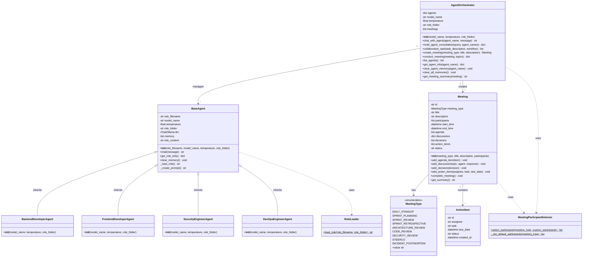
```mermaid
classDiagram
    class AgentOrchestrator {
        -dict agents
        -str model_name
        -float temperature
        -str role_folder
        -list meetings
        +__init__(model_name, temperature, role_folder)
        +chat_with_agent(agent_name, message) str
        +multi_agent_consultation(query, agent_names) dict
        +collaborative_task(task_description, workflow) list
        +create_meeting(meeting_type, title, description) Meeting
        +conduct_meeting(meeting, topics) dict
        +list_agents() list
        +get_agent_info(agent_name) dict
        +clear_agent_memory(agent_name) void
        +clear_all_memories() void
        +get_meeting_summary(meeting) str
    }

    class BaseAgent {
        -str role_filename
        -str model_name
        -float temperature
        -str role_folder
        -ChatOllama llm
        -list memory
        -str role_content
        +__init__(role_filename, model_name, temperature, role_folder)
        +chat(message) str
        +get_role_info() dict
        +clear_memory() void
        -_load_role() str
        -_create_prompt() str
    }

    class RoleLoader {
        +load_role(role_filename, role_folder)$ str
    }

    class Meeting {
        -str id
        -MeetingType meeting_type
        -str title
        -str description
        -list participants
        -datetime start_time
        -datetime end_time
        -list agenda
        -dict discussions
        -list decisions
        -list action_items
        -str status
        +__init__(meeting_type, title, description, participants)
        +add_agenda_item(item) void
        +add_discussion(topic, agent, response) void
        +add_decision(decision) void
        +add_action_item(assignee, task, due_date) void
        +complete_meeting() void
        +get_summary() str
    }

    class MeetingParticipantSelector {
        +select_participants(meeting_type, custom_participants)$ list
        -_get_default_participants(meeting_type)$ list
    }

    class MeetingType {
        <<enumeration>>
        DAILY_STANDUP
        SPRINT_PLANNING
        SPRINT_REVIEW
        SPRINT_RETROSPECTIVE
        ARCHITECTURE_REVIEW
        CODE_REVIEW
        SECURITY_REVIEW
        STEERCO
        INCIDENT_POSTMORTEM
        +value str
    }

    class ActionItem {
        -str id
        -str assignee
        -str task
        -datetime due_date
        -str status
        -datetime created_at
    }

    class BackendDeveloperAgent {
        +__init__(model_name, temperature, role_folder)
    }

    class FrontendDeveloperAgent {
        +__init__(model_name, temperature, role_folder)
    }

    class SecurityEngineerAgent {
        +__init__(model_name, temperature, role_folder)
    }

    class DevOpsEngineerAgent {
        +__init__(model_name, temperature, role_folder)
    }

    AgentOrchestrator "1" --> "*" BaseAgent : manages
    AgentOrchestrator "1" --> "*" Meeting : creates
    AgentOrchestrator ..> MeetingParticipantSelector : uses
    
    BaseAgent <|-- BackendDeveloperAgent : inherits
    BaseAgent <|-- FrontendDeveloperAgent : inherits
    BaseAgent <|-- SecurityEngineerAgent : inherits
    BaseAgent <|-- DevOpsEngineerAgent : inherits
    BaseAgent ..> RoleLoader : uses
    
    Meeting --> MeetingType : has
    Meeting "1" --> "*" ActionItem : contains
    Meeting ..> MeetingParticipantSelector : uses
```

### Agent Hierarchy Class Diagram

```mermaid
classDiagram
    class BaseAgent {
        <<abstract>>
        -str role_filename
        -ChatOllama llm
        -list memory
        +chat(message) str
        +get_role_info() dict
        +clear_memory() void
    }

    class DevelopmentAgents {
        <<category>>
    }

    class OperationsAgents {
        <<category>>
    }

    class DataAgents {
        <<category>>
    }

    class ManagementAgents {
        <<category>>
    }

    class BackendDeveloperAgent
    class FrontendDeveloperAgent
    class FullStackDeveloperAgent
    class MobileAndroidAgent
    class MobileIOSAgent
    class QAEngineerAgent
    class UIUXDesignerAgent
    class TechnicalWriterAgent
    class SecurityEngineerAgent

    class DevOpsEngineerAgent
    class SiteReliabilityEngineerAgent
    class NetworkEngineerAgent
    class SystemAdministratorAgent
    class CloudArchitectAgent
    class SolutionsArchitectAgent
    class DevOpsManagerAgent

    class DataEngineerAgent
    class DataAnalystAgent
    class BIAnalystAgent
    class DatabaseAdministratorAgent

    class ProductManagerAgent
    class ProjectManagerAgent
    class ScrumMasterAgent
    class EngineeringManagerAgent
    class ITManagerAgent
    class CTOAgent

    BaseAgent <|-- BackendDeveloperAgent
    BaseAgent <|-- FrontendDeveloperAgent
    BaseAgent <|-- FullStackDeveloperAgent
    BaseAgent <|-- MobileAndroidAgent
    BaseAgent <|-- MobileIOSAgent
    BaseAgent <|-- QAEngineerAgent
    BaseAgent <|-- UIUXDesignerAgent
    BaseAgent <|-- TechnicalWriterAgent
    BaseAgent <|-- SecurityEngineerAgent

    BaseAgent <|-- DevOpsEngineerAgent
    BaseAgent <|-- SiteReliabilityEngineerAgent
    BaseAgent <|-- NetworkEngineerAgent
    BaseAgent <|-- SystemAdministratorAgent
    BaseAgent <|-- CloudArchitectAgent
    BaseAgent <|-- SolutionsArchitectAgent
    BaseAgent <|-- DevOpsManagerAgent

    BaseAgent <|-- DataEngineerAgent
    BaseAgent <|-- DataAnalystAgent
    BaseAgent <|-- BIAnalystAgent
    BaseAgent <|-- DatabaseAdministratorAgent

    BaseAgent <|-- ProductManagerAgent
    BaseAgent <|-- ProjectManagerAgent
    BaseAgent <|-- ScrumMasterAgent
    BaseAgent <|-- EngineeringManagerAgent
    BaseAgent <|-- ITManagerAgent
    BaseAgent <|-- CTOAgent

    DevelopmentAgents ..> BackendDeveloperAgent
    DevelopmentAgents ..> FrontendDeveloperAgent
    DevelopmentAgents ..> FullStackDeveloperAgent
    DevelopmentAgents ..> MobileAndroidAgent
    DevelopmentAgents ..> MobileIOSAgent
    DevelopmentAgents ..> QAEngineerAgent
    DevelopmentAgents ..> UIUXDesignerAgent
    DevelopmentAgents ..> TechnicalWriterAgent
    DevelopmentAgents ..> SecurityEngineerAgent

    OperationsAgents ..> DevOpsEngineerAgent
    OperationsAgents ..> SiteReliabilityEngineerAgent
    OperationsAgents ..> NetworkEngineerAgent
    OperationsAgents ..> SystemAdministratorAgent
    OperationsAgents ..> CloudArchitectAgent
    OperationsAgents ..> SolutionsArchitectAgent
    OperationsAgents ..> DevOpsManagerAgent

    DataAgents ..> DataEngineerAgent
    DataAgents ..> DataAnalystAgent
    DataAgents ..> BIAnalystAgent
    DataAgents ..> DatabaseAdministratorAgent

    ManagementAgents ..> ProductManagerAgent
    ManagementAgents ..> ProjectManagerAgent
    ManagementAgents ..> ScrumMasterAgent
    ManagementAgents ..> EngineeringManagerAgent
    ManagementAgents ..> ITManagerAgent
    ManagementAgents ..> CTOAgent
```

### Meeting System Class Diagram

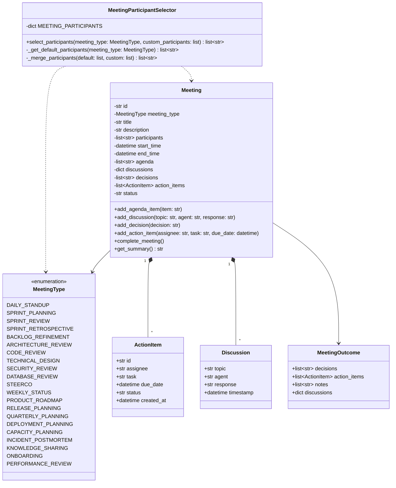
```mermaid
classDiagram
    class Meeting {
        -str id
        -MeetingType meeting_type
        -str title
        -str description
        -list~str~ participants
        -datetime start_time
        -datetime end_time
        -list~str~ agenda
        -dict discussions
        -list~str~ decisions
        -list~ActionItem~ action_items
        -str status
        +add_agenda_item(item: str)
        +add_discussion(topic: str, agent: str, response: str)
        +add_decision(decision: str)
        +add_action_item(assignee: str, task: str, due_date: datetime)
        +complete_meeting()
        +get_summary() str
    }

    class MeetingType {
        <<enumeration>>
        DAILY_STANDUP
        SPRINT_PLANNING
        SPRINT_REVIEW
        SPRINT_RETROSPECTIVE
        BACKLOG_REFINEMENT
        ARCHITECTURE_REVIEW
        CODE_REVIEW
        TECHNICAL_DESIGN
        SECURITY_REVIEW
        DATABASE_REVIEW
        STEERCO
        WEEKLY_STATUS
        PRODUCT_ROADMAP
        RELEASE_PLANNING
        QUARTERLY_PLANNING
        DEPLOYMENT_PLANNING
        CAPACITY_PLANNING
        INCIDENT_POSTMORTEM
        KNOWLEDGE_SHARING
        ONBOARDING
        PERFORMANCE_REVIEW
    }

    class ActionItem {
        +str id
        +str assignee
        +str task
        +datetime due_date
        +str status
        +datetime created_at
    }

    class Discussion {
        +str topic
        +str agent
        +str response
        +datetime timestamp
    }

    class MeetingParticipantSelector {
        -dict MEETING_PARTICIPANTS
        +select_participants(meeting_type: MeetingType, custom_participants: list) list~str~
        -_get_default_participants(meeting_type: MeetingType) list~str~
        -_merge_participants(default: list, custom: list) list~str~
    }

    class MeetingOutcome {
        +list~str~ decisions
        +list~ActionItem~ action_items
        +list~str~ notes
        +dict discussions
    }

    Meeting --> MeetingType
    Meeting "1" *-- "*" ActionItem
    Meeting "1" *-- "*" Discussion
    Meeting --> MeetingOutcome
    MeetingParticipantSelector ..> MeetingType
    MeetingParticipantSelector ..> Meeting
```

---

## Sequence Diagrams

### Single Agent Chat Sequence

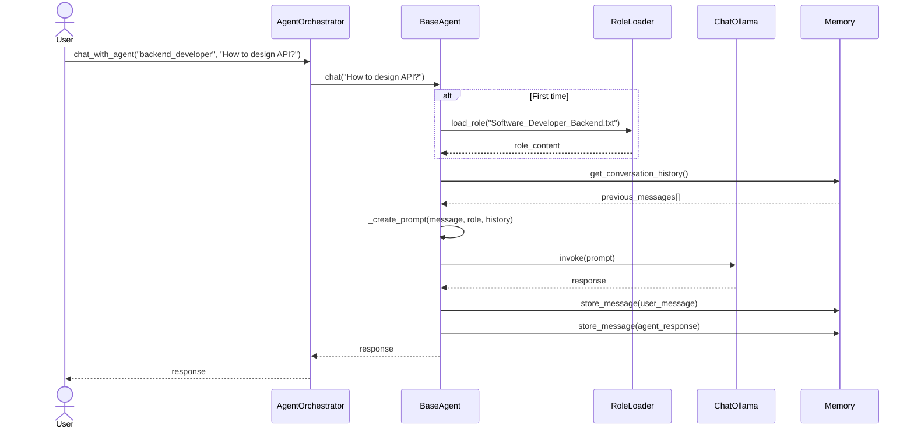
```mermaid
sequenceDiagram
    actor User
    participant Orchestrator as AgentOrchestrator
    participant Agent as BaseAgent
    participant RoleLoader
    participant LLM as ChatOllama
    participant Memory

    User->>Orchestrator: chat_with_agent("backend_developer", "How to design API?")
    Orchestrator->>Agent: chat("How to design API?")
    
    alt First time
        Agent->>RoleLoader: load_role("Software_Developer_Backend.txt")
        RoleLoader-->>Agent: role_content
    end
    
    Agent->>Memory: get_conversation_history()
    Memory-->>Agent: previous_messages[]
    
    Agent->>Agent: _create_prompt(message, role, history)
    Agent->>LLM: invoke(prompt)
    LLM-->>Agent: response
    
    Agent->>Memory: store_message(user_message)
    Agent->>Memory: store_message(agent_response)
    
    Agent-->>Orchestrator: response
    Orchestrator-->>User: response
```

### Multi-Agent Consultation Sequence

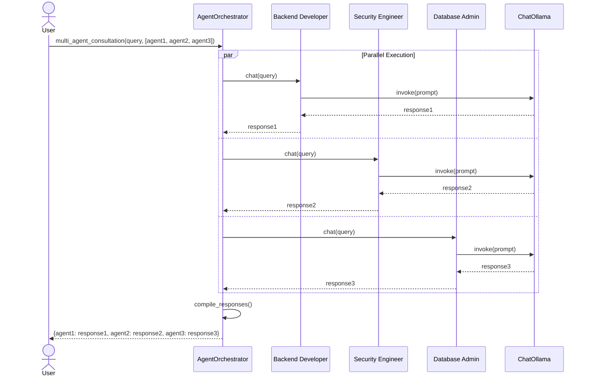
```mermaid
sequenceDiagram
    actor User
    participant Orchestrator as AgentOrchestrator
    participant Agent1 as Backend Developer
    participant Agent2 as Security Engineer
    participant Agent3 as Database Admin
    participant LLM as ChatOllama

    User->>Orchestrator: multi_agent_consultation(query, [agent1, agent2, agent3])
    
    par Parallel Execution
        Orchestrator->>Agent1: chat(query)
        Agent1->>LLM: invoke(prompt)
        LLM-->>Agent1: response1
        Agent1-->>Orchestrator: response1
    and
        Orchestrator->>Agent2: chat(query)
        Agent2->>LLM: invoke(prompt)
        LLM-->>Agent2: response2
        Agent2-->>Orchestrator: response2
    and
        Orchestrator->>Agent3: chat(query)
        Agent3->>LLM: invoke(prompt)
        LLM-->>Agent3: response3
        Agent3-->>Orchestrator: response3
    end
    
    Orchestrator->>Orchestrator: compile_responses()
    Orchestrator-->>User: {agent1: response1, agent2: response2, agent3: response3}
```

### Meeting Creation and Execution Sequence

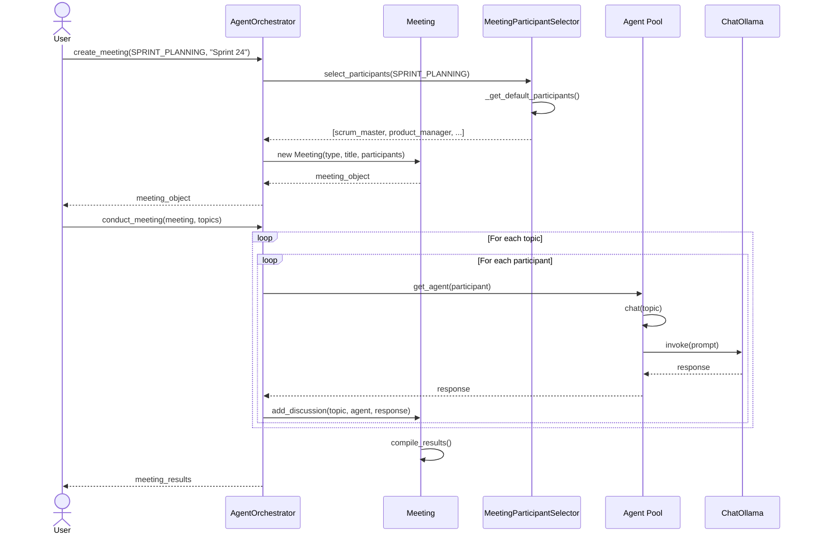
```mermaid
sequenceDiagram
    actor User
    participant Orchestrator as AgentOrchestrator
    participant MeetingSystem as Meeting
    participant Selector as MeetingParticipantSelector
    participant Agents as Agent Pool
    participant LLM as ChatOllama

    User->>Orchestrator: create_meeting(SPRINT_PLANNING, "Sprint 24")
    Orchestrator->>Selector: select_participants(SPRINT_PLANNING)
    Selector->>Selector: _get_default_participants()
    Selector-->>Orchestrator: [scrum_master, product_manager, ...]
    
    Orchestrator->>MeetingSystem: new Meeting(type, title, participants)
    MeetingSystem-->>Orchestrator: meeting_object
    Orchestrator-->>User: meeting_object
    
    User->>Orchestrator: conduct_meeting(meeting, topics)
    
    loop For each topic
        loop For each participant
            Orchestrator->>Agents: get_agent(participant)
            Agents->>Agents: chat(topic)
            Agents->>LLM: invoke(prompt)
            LLM-->>Agents: response
            Agents-->>Orchestrator: response
            Orchestrator->>MeetingSystem: add_discussion(topic, agent, response)
        end
    end
    
    MeetingSystem->>MeetingSystem: compile_results()
    Orchestrator-->>User: meeting_results
```

### Collaborative Workflow Sequence

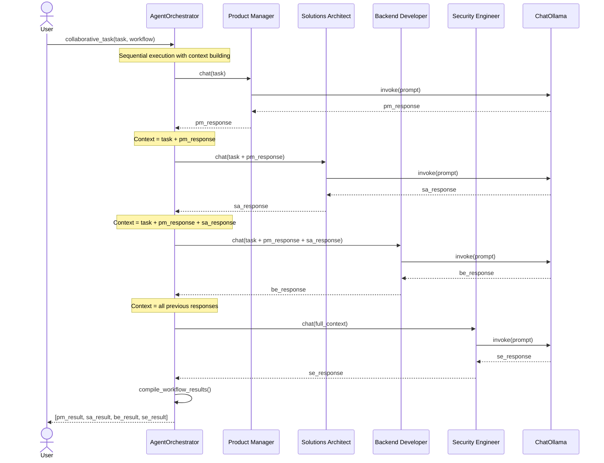
```mermaid
sequenceDiagram
    actor User
    participant Orchestrator as AgentOrchestrator
    participant PM as Product Manager
    participant SA as Solutions Architect
    participant BE as Backend Developer
    participant SE as Security Engineer
    participant LLM as ChatOllama

    User->>Orchestrator: collaborative_task(task, workflow)
    
    Note over Orchestrator: Sequential execution with context building
    
    Orchestrator->>PM: chat(task)
    PM->>LLM: invoke(prompt)
    LLM-->>PM: pm_response
    PM-->>Orchestrator: pm_response
    
    Note over Orchestrator: Context = task + pm_response
    
    Orchestrator->>SA: chat(task + pm_response)
    SA->>LLM: invoke(prompt)
    LLM-->>SA: sa_response
    SA-->>Orchestrator: sa_response
    
    Note over Orchestrator: Context = task + pm_response + sa_response
    
    Orchestrator->>BE: chat(task + pm_response + sa_response)
    BE->>LLM: invoke(prompt)
    LLM-->>BE: be_response
    BE-->>Orchestrator: be_response
    
    Note over Orchestrator: Context = all previous responses
    
    Orchestrator->>SE: chat(full_context)
    SE->>LLM: invoke(prompt)
    LLM-->>SE: se_response
    SE-->>Orchestrator: se_response
    
    Orchestrator->>Orchestrator: compile_workflow_results()
    Orchestrator-->>User: [pm_result, sa_result, be_result, se_result]
```

### Agent Memory Management Sequence

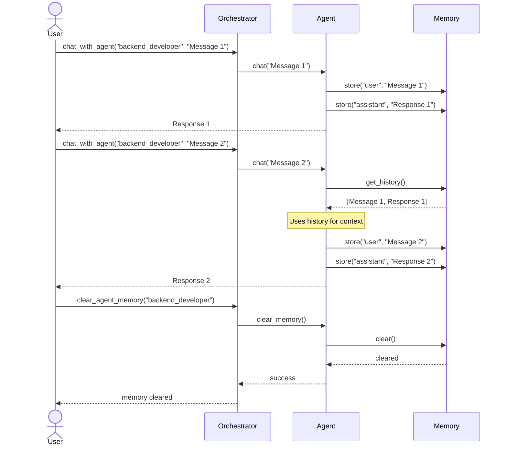
```mermaid
sequenceDiagram
    actor User
    participant Orchestrator
    participant Agent
    participant Memory

    User->>Orchestrator: chat_with_agent("backend_developer", "Message 1")
    Orchestrator->>Agent: chat("Message 1")
    Agent->>Memory: store("user", "Message 1")
    Agent->>Memory: store("assistant", "Response 1")
    Agent-->>User: Response 1
    
    User->>Orchestrator: chat_with_agent("backend_developer", "Message 2")
    Orchestrator->>Agent: chat("Message 2")
    Agent->>Memory: get_history()
    Memory-->>Agent: [Message 1, Response 1]
    Note over Agent: Uses history for context
    Agent->>Memory: store("user", "Message 2")
    Agent->>Memory: store("assistant", "Response 2")
    Agent-->>User: Response 2
    
    User->>Orchestrator: clear_agent_memory("backend_developer")
    Orchestrator->>Agent: clear_memory()
    Agent->>Memory: clear()
    Memory-->>Agent: cleared
    Agent-->>Orchestrator: success
    Orchestrator-->>User: memory cleared
```

---

## Component Diagrams

### System Components

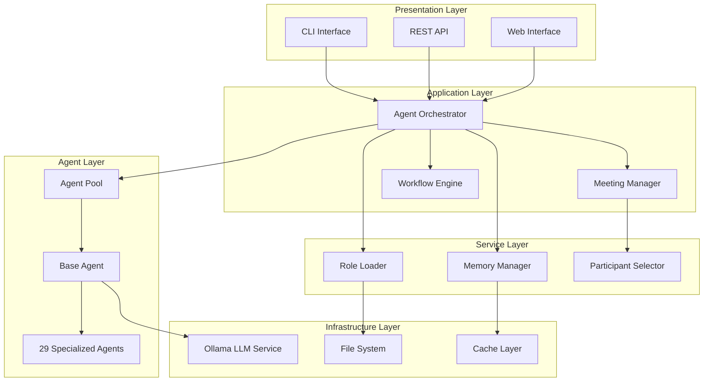
```mermaid
graph TB
    subgraph "Presentation Layer"
        CLI[CLI Interface]
        API[REST API]
        WEB[Web Interface]
    end
    
    subgraph "Application Layer"
        ORCH[Agent Orchestrator]
        MEET[Meeting Manager]
        WORK[Workflow Engine]
    end
    
    subgraph "Agent Layer"
        POOL[Agent Pool]
        BASE[Base Agent]
        AGENTS[29 Specialized Agents]
    end
    
    subgraph "Service Layer"
        ROLE[Role Loader]
        MEM[Memory Manager]
        SELECTOR[Participant Selector]
    end
    
    subgraph "Infrastructure Layer"
        LLM[Ollama LLM Service]
        FS[File System]
        CACHE[Cache Layer]
    end
    
    CLI --> ORCH
    API --> ORCH
    WEB --> ORCH
    
    ORCH --> MEET
    ORCH --> WORK
    ORCH --> POOL
    
    POOL --> BASE
    BASE --> AGENTS
    
    ORCH --> ROLE
    ORCH --> MEM
    MEET --> SELECTOR
    
    BASE --> LLM
    ROLE --> FS
    MEM --> CACHE
```

### Agent Component Structure

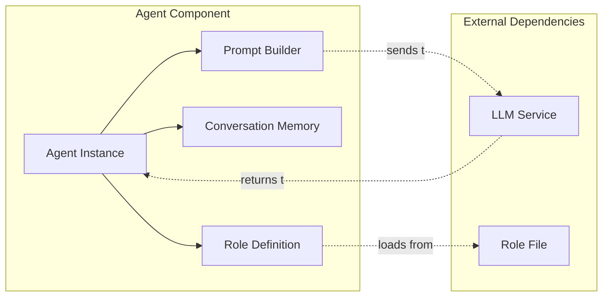
```mermaid
graph LR
    subgraph "Agent Component"
        AGENT[Agent Instance]
        ROLE_DATA[Role Definition]
        MEMORY[Conversation Memory]
        PROMPT[Prompt Builder]
    end
    
    subgraph "External Dependencies"
        LLM[LLM Service]
        ROLE_FILE[Role File]
    end
    
    AGENT --> ROLE_DATA
    AGENT --> MEMORY
    AGENT --> PROMPT
    
    ROLE_DATA -.loads from.-> ROLE_FILE
    PROMPT -.sends to.-> LLM
    LLM -.returns to.-> AGENT
```

### Meeting Component Structure

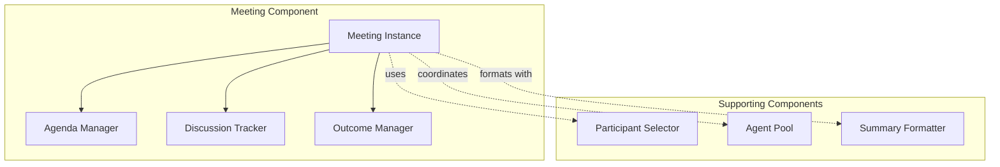
```mermaid
graph TB
    subgraph "Meeting Component"
        MEETING[Meeting Instance]
        AGENDA[Agenda Manager]
        DISCUSSION[Discussion Tracker]
        OUTCOME[Outcome Manager]
    end
    
    subgraph "Supporting Components"
        SELECTOR[Participant Selector]
        AGENTS[Agent Pool]
        FORMATTER[Summary Formatter]
    end
    
    MEETING --> AGENDA
    MEETING --> DISCUSSION
    MEETING --> OUTCOME
    
    MEETING -.uses.-> SELECTOR
    MEETING -.coordinates.-> AGENTS
    MEETING -.formats with.-> FORMATTER
```

---

## State Diagrams

### Meeting State Diagram

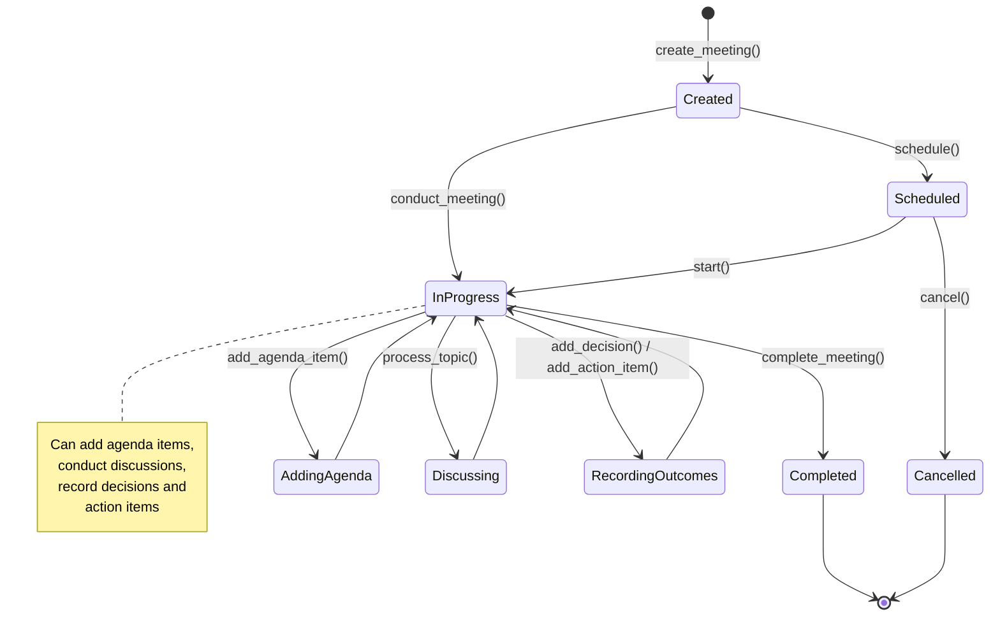
```mermaid
stateDiagram-v2
    [*] --> Created: create_meeting()
    
    Created --> Scheduled: schedule()
    Created --> InProgress: conduct_meeting()
    
    Scheduled --> InProgress: start()
    Scheduled --> Cancelled: cancel()
    
    InProgress --> AddingAgenda: add_agenda_item()
    InProgress --> Discussing: process_topic()
    InProgress --> RecordingOutcomes: add_decision() / add_action_item()
    
    AddingAgenda --> InProgress
    Discussing --> InProgress
    RecordingOutcomes --> InProgress
    
    InProgress --> Completed: complete_meeting()
    
    Completed --> [*]
    Cancelled --> [*]
    
    note right of InProgress
        Can add agenda items,
        conduct discussions,
        record decisions and
        action items
    end note
```

### Agent State Diagram

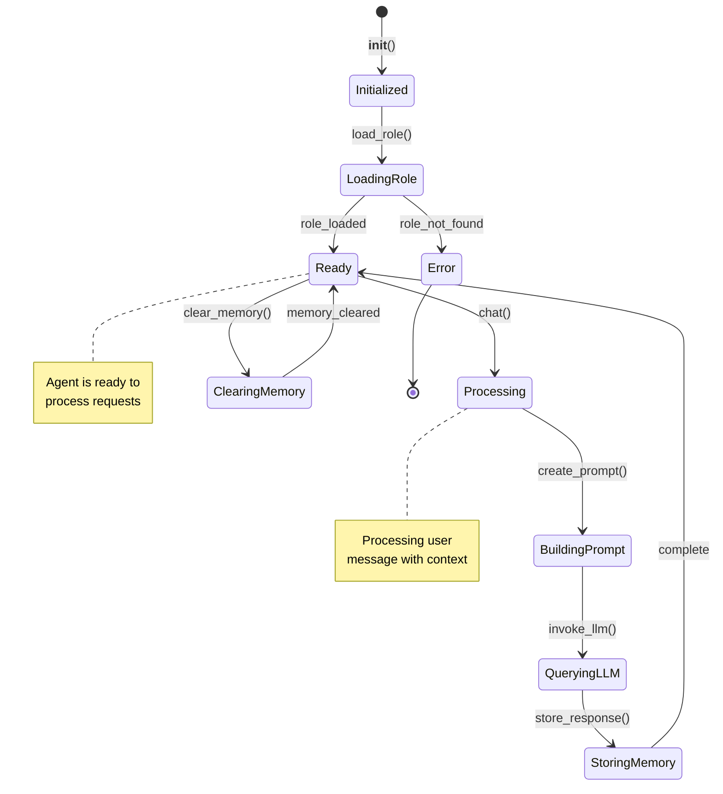
```mermaid
stateDiagram-v2
    [*] --> Initialized: __init__()
    
    Initialized --> LoadingRole: load_role()
    LoadingRole --> Ready: role_loaded
    LoadingRole --> Error: role_not_found
    
    Ready --> Processing: chat()
    Processing --> BuildingPrompt: create_prompt()
    BuildingPrompt --> QueryingLLM: invoke_llm()
    QueryingLLM --> StoringMemory: store_response()
    StoringMemory --> Ready: complete
    
    Ready --> ClearingMemory: clear_memory()
    ClearingMemory --> Ready: memory_cleared
    
    Error --> [*]
    
    note right of Ready
        Agent is ready to
        process requests
    end note
    
    note right of Processing
        Processing user
        message with context
    end note
```

### Action Item State Diagram

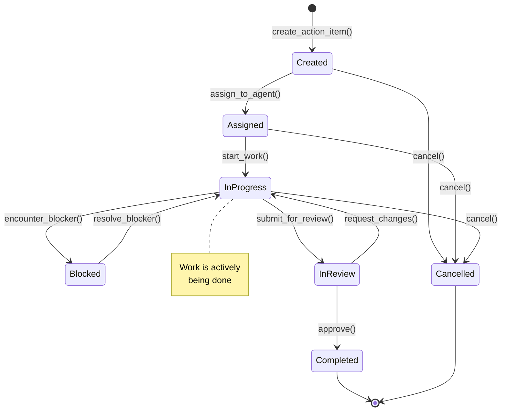
```mermaid
stateDiagram-v2
    [*] --> Created: create_action_item()
    
    Created --> Assigned: assign_to_agent()
    Assigned --> InProgress: start_work()
    
    InProgress --> Blocked: encounter_blocker()
    Blocked --> InProgress: resolve_blocker()
    
    InProgress --> InReview: submit_for_review()
    InReview --> InProgress: request_changes()
    InReview --> Completed: approve()
    
    Created --> Cancelled: cancel()
    Assigned --> Cancelled: cancel()
    InProgress --> Cancelled: cancel()
    
    Completed --> [*]
    Cancelled --> [*]
    
    note right of InProgress
        Work is actively
        being done
    end note
```

---

## Activity Diagrams

### Agent Chat Activity

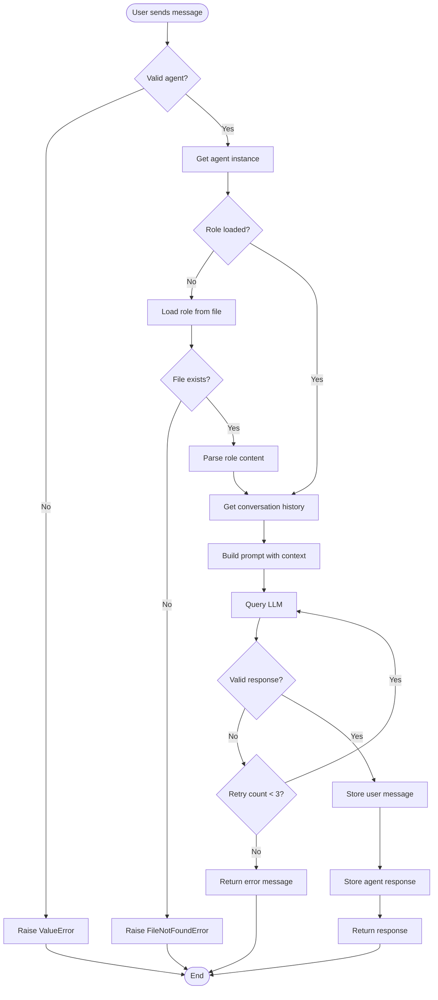
```mermaid
flowchart TD
    START([User sends message]) --> VALIDATE{Valid agent?}
    
    VALIDATE -->|No| ERROR1[Raise ValueError]
    VALIDATE -->|Yes| GET_AGENT[Get agent instance]
    
    GET_AGENT --> CHECK_ROLE{Role loaded?}
    CHECK_ROLE -->|No| LOAD_ROLE[Load role from file]
    CHECK_ROLE -->|Yes| GET_MEMORY
    
    LOAD_ROLE --> CHECK_FILE{File exists?}
    CHECK_FILE -->|No| ERROR2[Raise FileNotFoundError]
    CHECK_FILE -->|Yes| PARSE_ROLE[Parse role content]
    
    PARSE_ROLE --> GET_MEMORY[Get conversation history]
    GET_MEMORY --> BUILD_PROMPT[Build prompt with context]
    
    BUILD_PROMPT --> QUERY_LLM[Query LLM]
    QUERY_LLM --> CHECK_RESPONSE{Valid response?}
    
    CHECK_RESPONSE -->|No| RETRY{Retry count < 3?}
    RETRY -->|Yes| QUERY_LLM
    RETRY -->|No| ERROR3[Return error message]
    
    CHECK_RESPONSE -->|Yes| STORE_USER[Store user message]
    STORE_USER --> STORE_RESPONSE[Store agent response]
    
    STORE_RESPONSE --> RETURN[Return response]
    
    ERROR1 --> END([End])
    ERROR2 --> END
    ERROR3 --> END
    RETURN --> END
```

### Meeting Conduct Activity

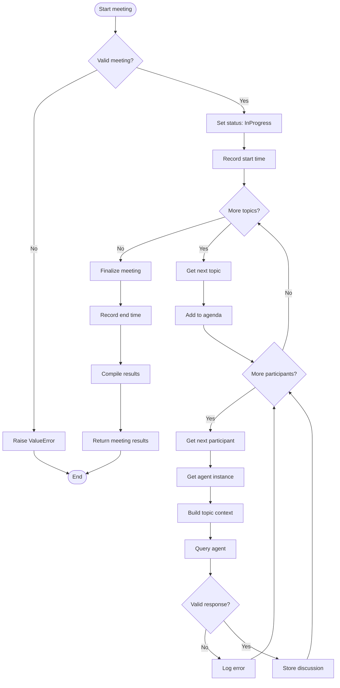
```mermaid
flowchart TD
    START([Start meeting]) --> VALIDATE{Valid meeting?}
    
    VALIDATE -->|No| ERROR[Raise ValueError]
    VALIDATE -->|Yes| SET_STATUS[Set status: InProgress]
    
    SET_STATUS --> RECORD_START[Record start time]
    RECORD_START --> LOOP_TOPICS{More topics?}
    
    LOOP_TOPICS -->|No| FINALIZE
    LOOP_TOPICS -->|Yes| GET_TOPIC[Get next topic]
    
    GET_TOPIC --> ADD_AGENDA[Add to agenda]
    ADD_AGENDA --> LOOP_PARTICIPANTS{More participants?}
    
    LOOP_PARTICIPANTS -->|No| LOOP_TOPICS
    LOOP_PARTICIPANTS -->|Yes| GET_PARTICIPANT[Get next participant]
    
    GET_PARTICIPANT --> GET_AGENT[Get agent instance]
    GET_AGENT --> BUILD_CONTEXT[Build topic context]
    
    BUILD_CONTEXT --> QUERY_AGENT[Query agent]
    QUERY_AGENT --> CHECK_RESPONSE{Valid response?}
    
    CHECK_RESPONSE -->|No| LOG_ERROR[Log error]
    CHECK_RESPONSE -->|Yes| STORE_DISCUSSION[Store discussion]
    
    LOG_ERROR --> LOOP_PARTICIPANTS
    STORE_DISCUSSION --> LOOP_PARTICIPANTS
    
    FINALIZE[Finalize meeting] --> RECORD_END[Record end time]
    RECORD_END --> COMPILE[Compile results]
    COMPILE --> RETURN[Return meeting results]
    
    ERROR --> END([End])
    RETURN --> END
```

### Collaborative Workflow Activity

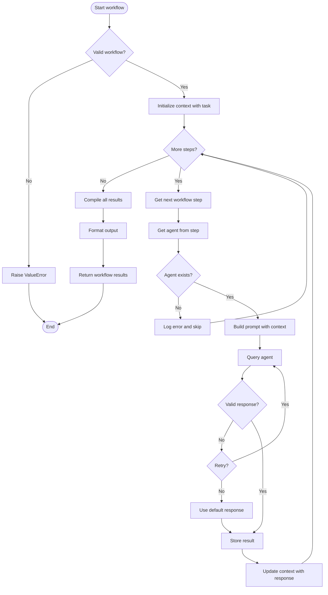
```mermaid
flowchart TD
    START([Start workflow]) --> VALIDATE{Valid workflow?}
    
    VALIDATE -->|No| ERROR[Raise ValueError]
    VALIDATE -->|Yes| INIT_CONTEXT[Initialize context with task]
    
    INIT_CONTEXT --> LOOP_STEPS{More steps?}
    
    LOOP_STEPS -->|No| COMPILE
    LOOP_STEPS -->|Yes| GET_STEP[Get next workflow step]
    
    GET_STEP --> GET_AGENT[Get agent from step]
    GET_AGENT --> CHECK_AGENT{Agent exists?}
    
    CHECK_AGENT -->|No| LOG_ERROR[Log error and skip]
    CHECK_AGENT -->|Yes| BUILD_PROMPT[Build prompt with context]
    
    BUILD_PROMPT --> QUERY_AGENT[Query agent]
    QUERY_AGENT --> CHECK_RESPONSE{Valid response?}
    
    CHECK_RESPONSE -->|No| RETRY{Retry?}
    RETRY -->|Yes| QUERY_AGENT
    RETRY -->|No| USE_DEFAULT[Use default response]
    
    CHECK_RESPONSE -->|Yes| STORE_RESULT[Store result]
    USE_DEFAULT --> STORE_RESULT
    
    STORE_RESULT --> UPDATE_CONTEXT[Update context with response]
    UPDATE_CONTEXT --> LOOP_STEPS
    
    LOG_ERROR --> LOOP_STEPS
    
    COMPILE[Compile all results] --> FORMAT[Format output]
    FORMAT --> RETURN[Return workflow results]
    
    ERROR --> END([End])
    RETURN --> END
```

---

## Deployment Diagrams

### Local Deployment

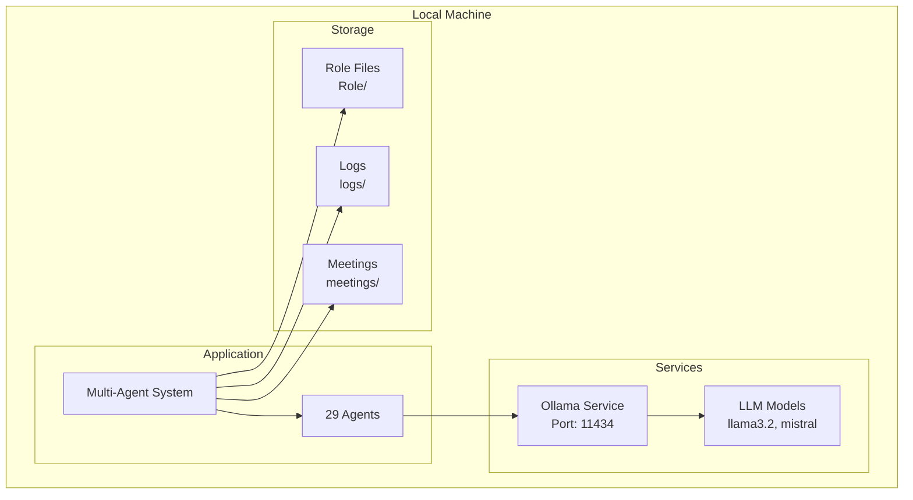
```mermaid
graph TB
    subgraph "Local Machine"
        subgraph "Application"
            APP[Multi-Agent System]
            AGENTS[29 Agents]
        end
        
        subgraph "Services"
            OLLAMA[Ollama Service<br/>Port: 11434]
            MODELS[LLM Models<br/>llama3.2, mistral]
        end
        
        subgraph "Storage"
            ROLES[Role Files<br/>Role/]
            LOGS[Logs<br/>logs/]
            MEETINGS[Meetings<br/>meetings/]
        end
    end
    
    APP --> AGENTS
    AGENTS --> OLLAMA
    OLLAMA --> MODELS
    APP --> ROLES
    APP --> LOGS
    APP --> MEETINGS
```

### Docker Deployment

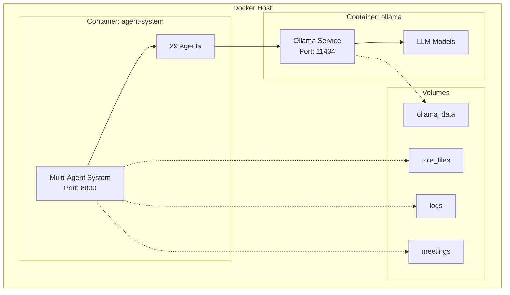
```mermaid
graph TB
    subgraph "Docker Host"
        subgraph "Container: ollama"
            OLLAMA[Ollama Service<br/>Port: 11434]
            MODELS[LLM Models]
        end
        
        subgraph "Container: agent-system"
            APP[Multi-Agent System<br/>Port: 8000]
            AGENTS[29 Agents]
        end
        
        subgraph "Volumes"
            VOL_OLLAMA[ollama_data]
            VOL_ROLES[role_files]
            VOL_LOGS[logs]
            VOL_MEETINGS[meetings]
        end
    end
    
    APP --> AGENTS
    AGENTS --> OLLAMA
    OLLAMA --> MODELS
    
    OLLAMA -.-> VOL_OLLAMA
    APP -.-> VOL_ROLES
    APP -.-> VOL_LOGS
    APP -.-> VOL_MEETINGS
```

### Kubernetes Deployment

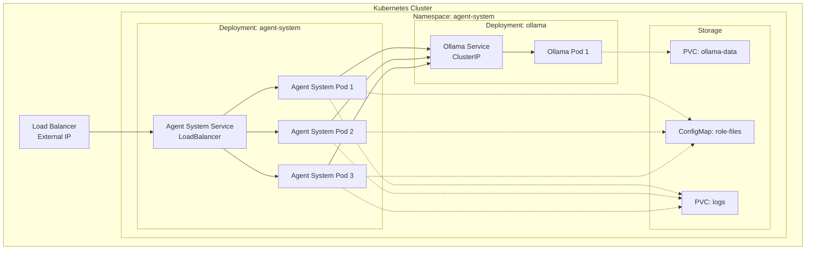
```mermaid
graph TB
    subgraph "Kubernetes Cluster"
        LB[Load Balancer<br/>External IP]
        
        subgraph "Namespace: agent-system"
            subgraph "Deployment: ollama"
                OLLAMA1[Ollama Pod 1]
                OLLAMA_SVC[Ollama Service<br/>ClusterIP]
            end
            
            subgraph "Deployment: agent-system"
                APP1[Agent System Pod 1]
                APP2[Agent System Pod 2]
                APP3[Agent System Pod 3]
                APP_SVC[Agent System Service<br/>LoadBalancer]
            end
            
            subgraph "Storage"
                PVC_OLLAMA[PVC: ollama-data]
                PVC_ROLES[ConfigMap: role-files]
                PVC_LOGS[PVC: logs]
            end
        end
    end
    
    LB --> APP_SVC
    APP_SVC --> APP1
    APP_SVC --> APP2
    APP_SVC --> APP3
    
    APP1 --> OLLAMA_SVC
    APP2 --> OLLAMA_SVC
    APP3 --> OLLAMA_SVC
    
    OLLAMA_SVC --> OLLAMA1
    
    OLLAMA1 -.-> PVC_OLLAMA
    APP1 -.-> PVC_ROLES
    APP1 -.-> PVC_LOGS
    APP2 -.-> PVC_ROLES
    APP2 -.-> PVC_LOGS
    APP3 -.-> PVC_ROLES
    APP3 -.-> PVC_LOGS
```

### Cloud Deployment (AWS)

```mermaid
graph TB
    subgraph "AWS Cloud"
        subgraph "VPC"
            subgraph "Public Subnet"
                ALB[Application Load Balancer]
                NAT[NAT Gateway]
            end
            
            subgraph "Private Subnet - AZ1"
                EC2_1[EC2 Instance 1<br/>Agent System]
                OLLAMA_1[Ollama Service]
            end
            
            subgraph "Private Subnet - AZ2"
                EC2_2[EC2 Instance 2<br/>Agent System]
                OLLAMA_2[Ollama Service]
            end
            
            subgraph "Storage"
                EFS[EFS<br/>Role Files & Logs]
                S3[S3<br/>Meeting Archives]
            end
        end
        
        CLOUDWATCH[CloudWatch<br/>Monitoring & Logs]
    end
    
    INTERNET[Internet] --> ALB
    ALB --> EC2_1
    ALB --> EC2_2
    
    EC2_1 --> OLLAMA_1
    EC2_2 --> OLLAMA_2
    
    EC2_1 --> EFS
    EC2_2 --> EFS
    EC2_1 --> S3
    EC2_2 --> S3
    
    EC2_1 --> CLOUDWATCH
    EC2_2 --> CLOUDWATCH
    
    EC2_1 --> NAT
    EC2_2 --> NAT
    NAT --> INTERNET
```

---

## Package Diagram

```mermaid
graph TB
    subgraph "agents"
        subgraph "agents.orchestrator"
            ORCH[AgentOrchestrator]
        end
        
        subgraph "agents.utils"
            BASE[BaseAgent]
            ROLE[RoleLoader]
            MEET[Meeting]
            SELECTOR[MeetingParticipantSelector]
            TYPES[MeetingType]
        end
        
        subgraph "agents.backend_developer"
            BE[BackendDeveloperAgent]
        end
        
        subgraph "agents.frontend_developer"
            FE[FrontendDeveloperAgent]
        end
        
        subgraph "agents.security_engineer"
            SE[SecurityEngineerAgent]
        end
        
        subgraph "agents.devops_engineer"
            DO[DevOpsEngineerAgent]
        end
        
        subgraph "agents.[24 more agents]"
            MORE[...]
        end
    end
    
    ORCH --> BASE
    ORCH --> MEET
    ORCH --> SELECTOR
    
    BE --> BASE
    FE --> BASE
    SE --> BASE
    DO --> BASE
    MORE --> BASE
    
    BASE --> ROLE
    MEET --> TYPES
    SELECTOR --> TYPES
```

---

## Object Diagram

### Runtime Object Relationships

```mermaid
graph LR
    subgraph "Runtime Objects"
        ORCH_OBJ[orchestrator: AgentOrchestrator]
        
        BE_OBJ[backend_dev: BackendDeveloperAgent]
        FE_OBJ[frontend_dev: FrontendDeveloperAgent]
        SE_OBJ[security_eng: SecurityEngineerAgent]
        
        MEET_OBJ[meeting: Meeting<br/>id: uuid-123<br/>type: SPRINT_PLANNING<br/>status: InProgress]
        
        ACTION1[action1: ActionItem<br/>assignee: backend_dev<br/>task: Implement API<br/>status: pending]
        
        ACTION2[action2: ActionItem<br/>assignee: frontend_dev<br/>task: Create UI<br/>status: pending]
    end
    
    ORCH_OBJ --> BE_OBJ
    ORCH_OBJ --> FE_OBJ
    ORCH_OBJ --> SE_OBJ
    ORCH_OBJ --> MEET_OBJ
    
    MEET_OBJ --> ACTION1
    MEET_OBJ --> ACTION2
```

---

## Use Case Diagram

```mermaid
graph TB
    subgraph "Actors"
        DEV[Developer]
        PM[Product Manager]
        DEVOPS[DevOps Engineer]
        ADMIN[System Admin]
    end
    
    subgraph "System: Multi-Agent Orchestrator"
        UC1[Chat with Agent]
        UC2[Multi-Agent Consultation]
        UC3[Create Meeting]
        UC4[Conduct Meeting]
        UC5[Collaborative Workflow]
        UC6[Manage Agent Memory]
        UC7[Configure System]
        UC8[Monitor Performance]
        UC9[View Meeting History]
        UC10[Export Meeting Summary]
    end
    
    DEV --> UC1
    DEV --> UC2
    DEV --> UC5
    DEV --> UC9
    
    PM --> UC3
    PM --> UC4
    PM --> UC9
    PM --> UC10
    
    DEVOPS --> UC7
    DEVOPS --> UC8
    
    ADMIN --> UC6
    ADMIN --> UC7
    ADMIN --> UC8
    
    UC4 -.includes.-> UC1
    UC5 -.includes.-> UC1
    UC10 -.includes.-> UC9
```

---

## Summary

This document provides comprehensive UML diagrams covering:

- **Class Diagrams**: System structure and relationships
- **Sequence Diagrams**: Interaction flows and message passing
- **Component Diagrams**: System components and dependencies
- **State Diagrams**: Object lifecycle and state transitions
- **Activity Diagrams**: Process flows and decision logic
- **Deployment Diagrams**: Physical deployment architectures
- **Package Diagram**: Code organization
- **Object Diagram**: Runtime object relationships
- **Use Case Diagram**: System functionality and actors

All diagrams use Mermaid syntax for easy rendering and maintenance.

---

**Last Updated**: 2024-01-15  
**Version**: 1.0.0  
**Total Diagrams**: 25+ UML diagrams
